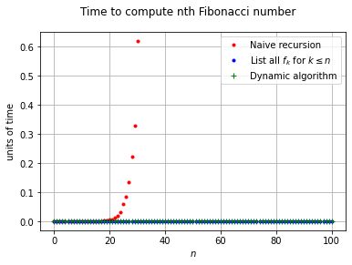

## Analysis of Euclid's Algorithm

<a id='introduction'></a>
### § 1. Introduction

<sup>Jump to: ↓ [Some plots](#pictures) | ↓ [Table of Contents](#toc) </sup>

Euclid's algorithm "might be called the grandaddy of all algorithms", as Knuth aptly put it [[5]](#references). Countless modern-day students know the joy of performing the algorithm by hand, essentially in the form set down by Euclid in his _Elements_ over two thousand years ago. Analyses of the algorithm go back as far as the 18th century, when it was understood (at least implicitly) that consecutive Fibonacci numbers give rise to the worst-case in terms of the number of divisions performed, relative to the size of the inputs. Average-case analyses and finer points received surprisingly little attention until the latter half of the last century. (See Knuth [[5]](#references) and Shallit [[9]](#references) for superlatively detailed accounts of the algorithm's fascinating history.) Only in recent decades has Euclid's algorithm been put into a general framework for the analysis of algorithms (by Baladi and Vallée [[1]](#references) et al.), in which certain algorithms are viewed as dynamical systems: the mathematics is as beautiful as it is deep. Although the current state-of-the-art paints a fairly detailed picture with respect to the distributional analysis of Euclid's algorithm, it still tantalises us with open questions, and these questions remain focal points of some exciting research programmes. 


Indeed, one of our goals here is to shed some light (numerically) on a certain "obscure" constant that arises in the analysis of Euclid's algorithm. Our main goal, though, is simply to demonstrate how fun and instructive it can be to study introductory discrete mathematics and statistics alongside basic Python. We'll code Euclid's algorithm, apply it to almost five billion pairs of integers to produce some data, then tabulate and visualise the results (the above animation is just one example). Along the way, we'll discuss the Fibonacci numbers and touch on **dynamic programming**, among other things like **random walks**... [Libraries](#libraries) we'll use include **NumPy**, **SciPy**, **Matplotlib**, and **pandas**. 

There are various ways of analysing Euclid's algorithm. Here is one example. Let $X$ be the random variable whose value is the number divisions performed in the computation of $\gcd(a,b)$ via Euclid's algorithm, with $(a,b)$ chosen uniformly at random from the region $1 \le b < a \le N$. It is known that $X$ is asymptotically normal (as $N \to \infty$), with mean close to $\lambda\log N + \nu - \frac{1}{2}$ and variance close to $\eta\log N + \kappa$, for certain constants $\lambda, \nu, \eta, \kappa$. While the constants associated with the mean can be written in closed form and easily calculated to any desired degree of accuracy ($\lambda = 0.8427659\ldots$ and $\nu = 0.0653514\ldots$), those associated with the variance cannot. Nevertheless, $\eta$ and $\kappa$ are polynomial-time computable, and the first seven digits of $\eta$ have been determined: $\eta = 0.5160524\ldots$. The "subdominant" constant $\kappa$ is even more mysterious, and our numerics will lead us to guess an approximate value for it (we believe it is around $-0.1$). 

In the above animation, the distribution of $X$ is shown for various $N$ up to $10^5$ (starting with $N = 1000$ and going up by $1000$ in each frame). The large blue dots give the probability that $X$ equals a given number on the horizontal axis. The dotted blue curve is normal with mean $\mu = \mathbb{E}[X]$ and variance $\sigma^2 = \mathrm{Var}(X)$, while the light blue curve is normal with mean $\mu_* = \lambda\log N + \nu - \frac{1}{2}$ and variance $\sigma_*^2 = \eta \log N - 0.1$. The red dots and curves are analagous, but only coprime pairs $(a,b)$ are considered. See [Two-dimensional analysis: distribution](#2d-distribution) for more detail and context.

<a id='pictures'></a>
#### Some plots

<sup>Jump to: ↑ [§ 1. Introduction](#introduction) | ↓ [Table of Contents](#toc)</sup>

Is this a _random walk?_ See [One-dimensional analysis: mean and error term](#1d-investigation-mean) for the answer.


See [One-dimensional analysis: mean and error term](#1d-investigation-mean) for the context of this instance of _square-root-cancellation_.


See [One-dimensional analysis: variance](#1d-investigation-variance) for more about the next two plots.


See [One-dimensional analysis: distribution](#1d-investigation) for an explanation of the animation below.


See [Two-dimensional analysis: error terms & subdominant constant in the variance](#2d-investigation) for an explanation of the plots below.


<a id='toc'></a>
#### Table of Contents

<sup>Jump to: ↑ [Some plots](#pictures) | ↓ [Libraries](#libraries) </sup>

 § 1... [Introduction](#introduction) [Maths/Visuals] <br>
 ............... [Some plots](#pictures) [Visuals] <br>
 § 2... [Libraries](#libraries) [Code] <br>
 § 3... [A quick recap of the GCD and Euclid's algorithm](#definitions) [Maths]<br>
    ............... [Code for Euclid's algorithm](#codeEuclid) [Code] <br>
 § 4... [Worst-case analysis](#worst-case) [Maths/Code] <br>
    ............... [The Fibonacci numbers and dynamic programming](#fibonacci) [Code] <br>
 § 5... [Constants](#constants) [Maths/Code] <br>
 § 6... [One-dimensional analysis](#1d-analysis) [Maths] <br>
    ............... [Average-case analysis](#1d-average-case) [Maths] <br>
    ............... [Error term, variance, and distribution](#1d-higher-moments) [Maths] <br>
 § 7... [Two-dimensional analysis](#2d-analysis) [Maths] <br> 
    ............... [Average-case analysis](#average-case) [Maths] <br>
    ............... [Variance and distribution](#distribution) [Maths] <br>
 § 8... [Code for analysing Euclid's algorithm](#code-for-analysing) [Code] <br>
 § 9... [Generating and exporting/importing the raw data](#raw-data) [Code] <br>
 § 10... [Numerical investigation & data visualisation](#numerical-investigation) <br>
     ............... [One-dimensional analysis: distribution](#1d-investigation) [Maths/Code/Visuals] <br>
     ............... [One-dimensional analysis: mean and error term](#1d-investigation-mean) [Maths/Code/Visuals] <br>
     ............... [One-dimensional analysis: variance](#1d-investigation-variance) [Maths/Code/Visuals] <br>
     ............... [Two-dimensional analysis: error terms & subdominant constant in the variance](#2d-investigation) [Maths/Code/Visuals] <br>
     ............... [Two-dimensional analysis: distribution](#2d-distribution) [Maths/Code/Visuals] <br>
[References](#references) 

<a id='libraries'></a>
### § 2. Libraries

<sup>Jump to: [Table of Contents](#toc) | ↓ [A quick recap of the GCD and Euclid's algorithm](#definitions)</sup>

```python
# We'll use the following libraries (by the end of this Notebook).

import numpy as np # Naturally, we'll need to do some numerics.
import pandas as pd # We'll want to put data in data frames to import and export it, and to display it nicely.
from timeit import default_timer as timer # We'll want to see how long certain computations take.
import scipy.stats as stats # We'll want to plot normal curves and so on.
from scipy.optimize import curve_fit # We'll want to do some curve-fitting.
from scipy.special import zeta # For certain constants involving the Riemann zeta function.
import matplotlib.pyplot as plt # We'll want to plot our data.
from matplotlib import animation # We'll even make animations to display our data.
from matplotlib import rc # For animations.
from IPython.display import HTML # For displaying and saving animations.
from matplotlib.animation import PillowWriter # To save animated gifs.
```

<a id='definitions'></a>
### § 3. A quick recap of the GCD and Euclid's algorithm

<sup>Jump to: [Table of Contents](#toc) | ↑ [Libraries](#libraries) | ↓ [Code for Euclid's algorithm](#codeEuclid)</sup>

---
**Proposition 3.1.** Let $a,b \in \mathbb{Z}$. There exists a unique nonnegative $g \in \mathbb{Z}$ such that, for any $d \in \mathbb{Z}$, $d \mid a$ and $d \mid b$ if and only if $d \mid g$. 

---
**Definition 3.2.** The integer $g$ is the _greatest common divisor_ of $a$ and $b$, denoted $\gcd(a,b)$. The common divisors of $a$ and $b$ are precisely the divisors of $\gcd(a,b)$.

---
The divisors of $g$ are the divisors of $-g$, so $-\gcd(a,b)$ satisfies the definition of greatest common divisor sans nonnegativity. Were we to generalize the notion of gcd to commutative rings, we would say that $g$ is _a_ gcd of $a$ and $b$ if the common divisors of $a$ and $b$ are precisely the divisors of $g$. Then, coming back to the integers, we would say that $g$ and $-g$ are both gcds of $a$ and $b$, but that gcds (in $\mathbb{Z}$) are unique _up to multiplcation by a unit_ ($\pm 1$).

Note that, for all $a \in \mathbb{Z}$, $\gcd(a,0) = |a|$ as all integers divide $0$ (hence the common divisors of $a$ and $0$ are the divisors of $a$). In particular, $\gcd(0,0) = 0$.

How can we compute $\gcd(a,b)$ when $a$ and $b$ are nonzero?

**Euclid's algorithm.** If $b \ge 1$, the division algorithm gives unique integers $q$ and $r$ such that $a = qb + r$ and $0 \le r < b$. It is straightforward to verify that the common divisors of $a$ and $b$ are precisely the common divisors of $b$ and $r$. Hence $\gcd(a,b) = \gcd(b,r)$. If $r > 0$ we may apply the division algorithm again: $b = q_2r + r_3$ with $0 \le r_3 < r$ and $\gcd(b,r) = \gcd(r,r_3)$. Repeating the process as many times as necessary, we obtain a sequence 

<a id='eq:rem_seq'></a>
$$a = r_0, b = r_1 > r = r_2 > r_3 > \cdots > r_n > r_{n + 1} = 0 \tag{3.1}$$ 

with the property that $\gcd(r_{i-1},r_{i}) = \gcd(r_{i},r_{i + 1})$ for $i = 1,\ldots,n$, because

<a id='eq:rem_seq2'></a>
$$r_{i - 1} = q_ir_i + r_{i + 1} \quad (i = 1,\ldots,n). \tag{3.2}$$

But $\gcd(r_n,r_{n + 1}) = \gcd(r_n,0) = r_n$, and so in this way we find the gcd of $a$ and $b$ (and of $\gcd(r_{i},r_{i + 1})$ for $i = 1,\ldots,n$). The case $b \le -1$ is similar, but instead of $(3.1)$ we have

<a id='eq:rem_seq_neg'></a>
$$a = r_0, b = r_1 < r_2 < r_3 < \cdots < r_{n} < r_{n + 1} = 0 \tag{3.3}$$

and $\gcd(a,b) = -r_n$. However, since $\gcd(a,b) = \gcd(|a|,|b|)$, we will typically assume that $a$ and $b$ are nonnegative.

---
**Definition 3.3.** Given $a,b \in \mathbb{Z}$, let $T(a,b) = n$ with $n$ as in [$(3.1)$](#eq:rem_seq) (if $b \ge 0$) or [$(3.3)$](#eq:rem_seq_neg) (if $b \le 0$). Thus, $T(a,b)$ is the number of "steps" or "divisions" in Euclid's algorithm for computing $\gcd(a,b)$. 

---

<a id='codeEuclid'></a>
#### Code for Euclid's algorithm

<sup>Jump to: [Table of Contents](#toc) | ↑ [A quick recap of the GCD and Euclid's algorithm](#definitions) | ↓ [Worst-case analysis](#worst-case)</sup>

```python
# Let's code Euclid's algorithm in a few different ways.
# No special libraries are required for this code block.
# If we just want gcd(a,b), this is about the most straightforward way. 

def gcd(a,b):
    if b == 0:
        return abs(a)
    return gcd(b,a%b)

# As a side-note, the definition of gcd extends in an obvious way to gcd of an n-tuple of integer, n >= 2.
# Namely, gcd(a_1,...,a_n) is the unique nonnegative integer with the following property.
# For any integer d, d divides every a_i if and only if d divides gcd(a_1,...,a_n).
# Thus, gcd(a_1,...,a_n) = gcd(a_1,gcd(a_2,...,a_n)), and we can use recursion to compute the gcd of an n-tuple, as below.

def gcdn(*ntuple): # arbitrary number of arguments
    if len(ntuple) == 2:
        return gcd(ntuple[0], ntuple[1])
    return gcd(ntuple[0],gcdn(*ntuple[1:]))

# If we want gcd(a,b) and the number of steps (T(a,b)), we can use this.

def gcd_steps(a,b,i): # Input i = 0
    if b == 0:
        return abs(a), i # Output gcd(a,b) and i = T(a,b)
    i += 1
    return gcd_steps(b,a%b,i)

# If we want the sequence of remainders 
# [r_0,r_1,r_2,...,r_n] (a = r_0, b = r_1, r_{n + 1} = 0, r_1 > r_2 > ... > r_n > 0),
# we can use this.

def rem(a,b,r): # Input r = []
    r.append(a)
    if b == 0:
        return r
    return rem(b,a%b,r) # gcd(a,b) = abs(r[-1]), gcd_steps = len(r) - 1

# If we want to record both remainders and quotients [q_1,...,q_n], we can use this.

def quot_rem(a,b,q,r): # Input r = [] and q = []
    r.append(a)
    if b == 0:
        return q, r
    (Q, R) = divmod(a,b)
    q.append(Q)
    return quot_rem(b,R,q,r) # rem(a,b,r) = quot_rem(a,b,q,r)[1]

# If we want to write out the entire process, we can use this.

def write_euclid(a,b): 
    q, r = quot_rem(a,b,[],[])  
    R = r[2:] # The next few lines are largely to facilitate the formatting of the output (alignment etc.)
    R.append(0)
    A, B, Q = r, r[1:], q 
    GCDcol = [f'gcd({a},{b})', f'gcd({b},{R[0]})']
    for i in range(len(R) - 1):
        GCDcol.append(f'gcd({R[i]},{R[i + 1]})')
    for i in range(len(B)): # For display, put parentheses around negative integers.
        if B[i] < 0:
            B[i] = f'({B[i]})'
    for i in range(len(Q)): # For display, put parentheses around negative integers.
        if Q[i] < 0:
            Q[i] = f'({Q[i]})' 
    pm = [] # Next few lines are so we display a = bq - r instead of a = bq + -r in the case where r < 0.
    for i in range(len(R)): 
        if R[i] < 0:
            R[i] = -R[i]
            pm.append('-')
        else:
            pm.append('+')
    colA = max([len(str(i)) for i in A]) # For alignment.
    colB = max([len(str(i)) for i in B])
    colQ = max([len(str(i)) for i in Q])
    colR = max([len(str(i)) for i in R])
    colGCDl = max([len(i) for i in GCDcol[:-2]])
    colGCDr = max([len(i) for i in GCDcol[1:]])
    if len(A) > 1:
        for i in range(len(R)):
            print(f'{A[i]:>{colA}} = {Q[i]:>{colQ}}*{B[i]:>{colB}} {pm[i]} {R[i]:>{colR}} \t ∴ {GCDcol[i]:>{colGCDl}} = {GCDcol[i + 1]:<{colGCDr}}')
    print(f'\ngcd({a},{b}) = {abs(r[-1])}, T({a},{b}) = {len(r) - 1}\n') 
```
```python
# Try out some of the above code.

write_euclid(1011,69)
```
```
1011 = 14*69 + 45 	 ∴ gcd(1011,69) = gcd(69,45)
  69 =  1*45 + 24 	 ∴   gcd(69,45) = gcd(45,24)
  45 =  1*24 + 21 	 ∴   gcd(45,24) = gcd(24,21)
  24 =  1*21 +  3 	 ∴   gcd(24,21) = gcd(21,3) 
  21 =  7* 3 +  0 	 ∴    gcd(21,3) = gcd(3,0)  

gcd(1011,69) = 3, T(1011,69) = 5
```

```python
write_euclid(-1011,-69)
```

```
-1011 = 14*(-69) - 45 	 ∴ gcd(-1011,-69) = gcd(-69,-45)
  -69 =  1*(-45) - 24 	 ∴   gcd(-69,-45) = gcd(-45,-24)
  -45 =  1*(-24) - 21 	 ∴   gcd(-45,-24) = gcd(-24,-21)
  -24 =  1*(-21) -  3 	 ∴   gcd(-24,-21) = gcd(-21,-3) 
  -21 =  7* (-3) +  0 	 ∴    gcd(-21,-3) = gcd(-3,0)   

gcd(-1011,-69) = 3, T(-1011,-69) = 5
```

<a id='worst-case'></a>
### § 4. Worst-case analysis

<sup>Jump to: [Table of Contents](#toc) | ↑ [Code for Euclid's algorithm](#codeEuclid) | ↓ [The Fibonacci numbers and dynamic programming](#fibonacci)</sup>

First let's record a result that will be useful in the sequel.

---
<a id='prop:4.1'></a>
**Proposition 4.1.** We have the following for $a \ge b \ge 1$. <br>
(a) $T(a,b) = 1$ if and only if $b \mid a$. <br>
(b) If $a > b$, $T(b,a) = T(a,b) + 1$. <br>
(c) For all positive integers $d$, $T(da,db) = T(a,b)$.

---
>_Proof._ (a) Simply note that $b \mid a$ if and only if there exists an integer $q$ such that $a = qb + 0$.
>
>(b) If $1 \le b < a$ then the first two divisions of the Euclidean algorithm for $\gcd(b,a)$ are: $b = 0a + b$ and $a = qb + r$, $0 \le r < b$. The second division is the first done in the Euclidean algorithm for $\gcd(a,b)$.
>
>(c) If [$(3.1)$](#eq:rem_seq) is the remainder sequence given by Euclid's algorithm for $\gcd(a,b)$, then for any positive integer $d$, 
>
>$$da = dr_0, db = dr_1 > dr_2 > \cdots > dr_n > dr_{n + 1} = 0$$
>
>is the remainder sequence given by Euclid's algorithm for $\gcd(da,db)$ (the quotients $q_i$ in [$(3.2)$](#eq:rem_seq2) won't change).

```python
# Let's illustrate the invariance of the number of divisions under (a,b) -> (da,db). 
# Take (a,b) as in the previous code block and d = 67.

write_euclid(67*1011,67*69)
```

```
# Let's illustrate the invariance of the number of divisions under (a,b) -> (da,db). 
# Take (a,b) as in the previous code block and d = 67.

write_euclid(67*1011,67*69)
```

What are the smallest possible values of $a$ and $b$ if $a \ge b \ge 1$ and $T(a,b) = n$? If $n = 1$ we need only note that $T(1,1) = 1$ to see that the answer is $a = b = 1$. Since $T(a,b) = 1$ if and only if $b \mid a$, the answer for $n \ge 2$ must satisfy $a > b \ge 2$ and $b \nmid a$. (In fact, by [Proposition 4.1(c)](#prop:4.1), the answer in general must satisfy $\gcd(a,b) = 1$, i.e. $r_n = 1$.) Noting that $T(3,2) = 2$ then gives the answer for $n = 2$ as $a = 3$ and $b = 2$. 

```python
# Some very naive code to answer the question: what are the smallest possible values of a and b if 
# a >= b >= 1 and T(a,b) = n?
# Basically a very inefficient way of computing Fibonacci numbers, the code really starts to get slow for n = 16.
# But the first few n are enough to help us see a pattern.

def W(n):
    a, b = 1, 1
    while gcd_steps(a,b,0)[1] < n:
        a += 1
        for b in range(1,a+1):
            if gcd_steps(a,b,0)[1] == n:
                return a, b
    return a, b

print(W(1), W(2), W(3), W(4), W(5), W(6), W(7), W(8), W(9), W(10))
```

```
(1, 1) (3, 2) (5, 3) (8, 5) (13, 8) (21, 13) (34, 21) (55, 34) (89, 55) (144, 89)
```

It isn't difficult to see that for a given $n \ge 2$, if $T(a,b) = n$, $a$ and $b$ will be minimal if, in [$(3.2)$](#eq:rem_seq2), $r_n = 1$, $r_{n - 1} = 2$, and $q_1 = q_2 = \cdots = q_{n - 1} = 1$. Thus, $r_{n - 2} = 1(2) + 1 = 3$, $r_{n - 3} = 1(3) + 2 = 5$, and so on.

```python
write_euclid(55,34)
```

```
55 = 1*34 + 21 	 ∴ gcd(55,34) = gcd(34,21)
34 = 1*21 + 13 	 ∴ gcd(34,21) = gcd(21,13)
21 = 1*13 +  8 	 ∴ gcd(21,13) = gcd(13,8) 
13 = 1* 8 +  5 	 ∴  gcd(13,8) = gcd(8,5)  
 8 = 1* 5 +  3 	 ∴   gcd(8,5) = gcd(5,3)  
 5 = 1* 3 +  2 	 ∴   gcd(5,3) = gcd(3,2)  
 3 = 1* 2 +  1 	 ∴   gcd(3,2) = gcd(2,1)  
 2 = 2* 1 +  0 	 ∴   gcd(2,1) = gcd(1,0)  

gcd(55,34) = 1, T(55,34) = 8
```

These are the Fibonacci numbers!

---
**Definition 4.2.** Let $f_0 = 0$, $f_1 = 1$, and $f_{n+2} = f_{n + 1} + f_{n}$ for $n \ge 0$. Then $(f_0,f_1,\ldots)$ is the _Fibonacci sequence_, and $f_n$ is the $n$-th _Fibonacci number_.

---
<a id='prop:4.3'></a>
**Proposition 4.3.** Let $a \ge b \ge 1$. (a) For $n \ge 0$, we have $\gcd(f_{n + 1},f_{n}) = 1$. For $n \ge 1$, we have $T(f_{n + 2},f_{n + 1}) = n$. (b) If $n \ge 1$ and $T(a,b) = n$, then $a \ge f_{n + 2}$ and $b \ge f_{n+1}$. 

---
>_Proof._ (a) Since $f_{n + 2} = f_{n + 1} + f_{n}$, we have $\gcd(f_{n + 2},f_{n + 1}) = \gcd(f_{n + 1},f_{n})$. Since $\gcd(f_1,f_0) = \gcd(1,0) = 1$, that $\gcd(f_{n + 1},f_n) = 1$ for all $n \ge 0$ now follows by mathematical induction. 
>
>Also, since $f_{n + 2} = f_{n + 1} + f_n$ _and_ $0 \le f_n < f_{n + 1}$ for $n \ge 2$, we have $T(f_{n + 2},f_{n + 1}) = T(f_{n + 1}, f_n) + 1$ for $n \ge 2$. Since $T(f_{1 + 2},f_{1 + 1}) = T(2,1) = 1$, that $T(f_{n + 2},f_{n + 1}) = n$ for all $n \ge 1$ now follows by mathematical induction. 
>
>(b) We've verified the result for $n = 1$ and $n = 2$, so let $n \ge 2$ and suppose the result holds for $n$. Let $T(a,b) = n + 1$. Since this is greater than $1$, $b \nmid a$ (as noted above), and $a = qb + r$ for some $q$ and $r$ with $q \ge 1$ and $1 \le r < b$. Now, $T(b,r) = n$ and so, by inductive hypothesis, $b \ge f_{n + 2}$ and $r \ge f_{n + 1}$. Thus, $a = qb + r \ge f_{n + 2} + f_{n+1} = f_{n + 3}$. In conclusion, $a \ge f_{n + 3}$ and $b \ge f_{n + 2}$, and the result holds for all $n \ge 2$, by mathematical induction.

---
**Remark 4.4.** For $a \ge b \ge 1$ and $n \ge 1$, the contrapositive of part (b) of the above proposition is: if either $a < f_{n + 2}$ or $b < f_{n + 1}$, then $T(a,b) \le n - 1$.

---

```python
# Let's test this out for small n. 
# In the table below, row a column b contains T(a,b).
# Below the diagonal corresponds to a > b.
# Note that, for instance, the first time 4 appears below the diagonal is in row 8, column 5: 8 = f_6 and 5 = f_5.

test_dict = {}
for a in range(14):
    test_dict[a] = {}
    for b in range(14):
        test_dict[a][b] = gcd_steps(a,b,0)[1]
        
# To "tabulate" our data, we'll use pandas. 
# import pandas as pd # Only needed if not already pre-loaded.

pd.DataFrame.from_dict(test_dict, orient='index')#.astype('int')
```

```
	0	1	2	3	4	5	6	7	8	9	10	11	12	13
0	0	1	1	1	1	1	1	1	1	1	1	1	1	1
1	0	1	2	2	2	2	2	2	2	2	2	2	2	2
2	0	1	1	3	2	3	2	3	2	3	2	3	2	3
3	0	1	2	1	3	4	2	3	4	2	3	4	2	3
4	0	1	1	2	1	3	3	4	2	3	3	4	2	3
5	0	1	2	3	2	1	3	4	5	4	2	3	4	5
6	0	1	1	1	2	2	1	3	3	3	4	4	2	3
7	0	1	2	2	3	3	2	1	3	4	4	5	5	4
8	0	1	1	3	1	4	2	2	1	3	3	5	3	6
9	0	1	2	1	2	3	2	3	2	1	3	4	3	4
10	0	1	1	2	2	1	3	3	2	2	1	3	3	4
11	0	1	2	3	3	2	3	4	4	3	2	1	3	4
12	0	1	1	1	1	3	1	4	2	2	2	2	1	3
13	0	1	2	2	2	4	2	3	5	3	3	3	2	1
```

<a id='fibonacci'></a>
#### The Fibonacci numbers and dynamic programming

<sup>Jump to: [Table of Contents](#toc) | ↑ [Worst-case analysis](#worst-case) | ↓ [Constants](#constants)</sup>

```python
# In this code block we will use matplotlib.pyplot and default_timer from timeit.
# Let's take a detour and compute some Fibonacci numbers.
# Computing f_n naively takes time exponential in n.
# E.g. to compute f_5 naively we do this: 
# f_5 = f_4 + f_3 
#     = f_3 + f_2 + f_2 + f_1 
#     = f_2 + f_1 + f_1 + f_0 + f_1 + f_0 + 1
#     = f_1 + 1 + 1 + 0 + 1 + 0 + 1
#     = 1 + 1 + 1 + 0 + 1 + 0 + 1
#     = 5
# We can think of this as a tree with f_5 at the top, 
# and where each parent node has two children until the node corresponds to f_1 or f_0. 
# We end up having to sum a sequence of 1's and 0's of length f_n, 
# and we know f_n is of order phi^n, where phi is the golden ratio.

def naive_fib(n):
    if n == 0:
        return 0
    if n == 1:
        return 1
    if n > 1:
        return naive_fib(n - 1) + naive_fib(n - 2)
    if n < 0:
        return naive_fib(-n) # Why not?

# from timeit import default_timer as timer # Only needed if not already pre-loaded.
naive_time = []
for n in range(31):
    start = timer()
    naive_fib(n)
    end = timer()
    naive_time.append(end - start)
    
# Of course it is very silly to compute fib(n) from scratch if you've just computed f_0,f_1,...,f_{n-1}.
# Let's compute f_n the way a human might do it: by starting at the beginning.

FIB = []
list_time = []
for n in range(101):
    start = timer()
    if (n == 0 or n == 1):
        FIB.append(n)
    else:
        FIB.append(FIB[n - 1] + FIB[n - 2])
    end = timer()
    list_time.append(end - start)

# Now if we want to compute f_n but don't want to have to maintain an ever-expanding list 
# of all previous Fibonacci numbers, we can do the following.
# This algorithm computes f_n in O(n) time for n >= 1 
# (a unit of time being the time taken to do an addition and update a couple of variables).
# There are only about n additions needed in this algorithm.
# This is the archetypal example of dynamic programming, specifically memoization.
# a and b in the code below essentially constitute a hash table, which is updated in each iteration. 
# Perhaps the previous code (generating a list of all Fibonacci numbers) up to f_n, is an example 
# of tabulation.

def fib(n):
    a, b = 0, 1 # a and b will be placeholders for fib(n - 2) and fib(n - 1)
    if n == 0:
        return a
    if n == 1:
        return b
    if n < 0: 
        return fib(-n) # Why not?
    for k in range(n-1):
        c = a + b # c will be fib(n) ultimately. 
        a = b # First, k = 0, c = 0 + 1 = 1, a -> 1, b -> 1.
        b = c # Then, k = 1, c -> 1 + 1 = 2, a -> 1, b -> 2. And so on.
    return c

dynamic_time = []
for n in range(101):
    start = timer()
    fib(n)
    end = timer()
    dynamic_time.append(end - start)

#import matplotlib.pyplot as plt # Only needed if not already pre-loaded.
fig, ax = plt.subplots()
fig.suptitle('Time to compute nth Fibonacci number')
x = [n for n in range(101)]
ax.plot(x[:31],naive_time,'r.', label='Naive recursion')
ax.plot(x,list_time,'b.', label=f'List all $f_k$ for $k \leq n$')
plt.plot(x,dynamic_time,'g+', label='Dynamic algorithm')
ax.set_xlabel(r'$n$')
ax.set_ylabel('units of time')
ax.grid(True)
ax.legend()
plt.show()
```



We can show that if $\phi$ and $\psi$ are the roots of $x^2 - x - 1$, then for $n \ge 0$,

<a id='eq:fib_phi'></a>
$$f_n = \frac{\phi^{n} - \psi^n}{\phi - \psi}. \tag{4.1}$$

For any root $\lambda$ of $x^2 - x - 1$ satisfies $\lambda^{n + 2} - \lambda^{n + 1} - \lambda = 0$ for all $n \ge 0$, just as the Fibonacci numbers satisfy $f_{n + 2} - f_{n + 1} - f_{n} = 0$ for $n \ge 0$. It follows that if $c_1$ and $c_2$ are constants such that $f_n = c_1\phi^n + c_2\psi^n$ for $n = 0$ and $n = 1$, then this equation holds for all $n \ge 0$. Letting $n = 0$ shows that $c_2 = -c_1$, and then letting $n = 1$ gives $c_1 = 1/(\phi - \psi)$. We let $\phi = \frac{1}{2}(1 + \sqrt{5})$ be the positive root (the golden ratio), and $\psi = \frac{1}{2}(1 - \sqrt{5})$ be the other. Thus, $\phi - \psi = \sqrt{5}$, and $f_n$ is the integer nearest $\phi^n/\sqrt{5}$.

```python
# Let's try this out. 
# In fact, phi^n/sqrt(5) < f_n when n is odd, and phi^n/sqrt(5) > f_n when n is even.

# import numpy as np # Only needed if not already pre-loaded.

phi, psi = np.roots([1,-1,-1])

def fib_closed_form(n):
    return (phi**(n) - psi**(n))/(phi - psi)

for n in range(11):
    print(f'n = {n}, f_n = {fib(n)}, phi^n/(phi - psi) = {phi**(n)/(phi - psi):.3f}..., nearest int = {int(np.rint(phi**(n)/(phi - psi)))}')
```

```
n = 0, f_n = 0, phi^n/(phi - psi) = 0.447..., nearest int = 0
n = 1, f_n = 1, phi^n/(phi - psi) = 0.724..., nearest int = 1
n = 2, f_n = 1, phi^n/(phi - psi) = 1.171..., nearest int = 1
n = 3, f_n = 2, phi^n/(phi - psi) = 1.894..., nearest int = 2
n = 4, f_n = 3, phi^n/(phi - psi) = 3.065..., nearest int = 3
n = 5, f_n = 5, phi^n/(phi - psi) = 4.960..., nearest int = 5
n = 6, f_n = 8, phi^n/(phi - psi) = 8.025..., nearest int = 8
n = 7, f_n = 13, phi^n/(phi - psi) = 12.985..., nearest int = 13
n = 8, f_n = 21, phi^n/(phi - psi) = 21.010..., nearest int = 21
n = 9, f_n = 34, phi^n/(phi - psi) = 33.994..., nearest int = 34
n = 10, f_n = 55, phi^n/(phi - psi) = 55.004..., nearest int = 55
```

We are now ready to establish the worst-case result for the number of divisions in Euclid's algorithm. The following propostion implies that for $N \ge 2$, 

\begin{align*}
\max{T(a,b) : 1 \le b \le a \le N} = \Theta(\log N).
\end{align*}

---
<a id='prop:worst_case'></a>
**Proposition 4.5.** For $N \ge 2$,  

$$\frac{\log(N - 1)}{\log \phi} - 1.328 < \max{T(a,b) : 1 \le b \le a \le N} < \frac{\log(N + 1)}{\log \phi} - 0.327.$$

---

Note that $1/\log \phi = 2.0780869\ldots$.

>_Proof._ First of all, if $m \ge 1$ then $f_{n + 1} \le m < f_{n + 2}$ for some $n \ge 1$. Thus, in view of [$(4.1)$](#eq:fib_phi), we have (for $m \ge 2$ in the left inequality)
>
>$$\frac{\log(m - 1)}{\log \phi} - 0.328 < n < \frac{\log(m + 1)}{\log \phi} + 0.673. \tag{$*$}$$
>
>To see this in more detail, note that $f_{k} = \lfloor \phi^k/(\phi - \psi)\rfloor$ if $k$ is even, while $f_{k} = \lceil \phi^k/(\phi - \psi)\rceil$ if $k$ is odd; also, $\phi - \psi = \sqrt{5}$. Thus, supposing first that $n$ is even, 
>
>$$\frac{\phi^{n+1}}{\sqrt{5}} < f_n \le m < f_{n + 2} < \frac{\phi^{n+2}}{\sqrt{5}}.$$
>
>Taking logarithms, we see that 
>
>$$n + 1 < \frac{\log m + \frac{1}{2}\log 5}{\log \phi} < n + 2,$$
>
> leading (after a calculation) to
> 
>$$ \frac{\log m}{\log \phi} - 0.3277\ldots < n < \frac{\log m}{\log \phi} + 0.6722\ldots .$$
>
> Similarly, if $n$ is odd and $m \ge 2$, then
>  
>$$ \frac{\log(m-1)}{\log \phi} - 0.3277\ldots < n < \frac{\log(m + 1)}{\log \phi} + 0.6722\ldots .$$
>
> Combining gives $(*)$.
>
>(a) Now, let $N \ge 2$ be given, and let $n \ge 2$ be such that $f_{n + 1} \le N < f_{n + 2}$. By [Proposition 4.3(b)](#prop:4.3), for $1 \le b \le a \le N$, we have $T(a,b) \le n - 1$, with equality attained when $a = f_{n + 1}$ and $b = f_{n}$. That is, 
>
>$$\max{T(a,b) : 1 \le b \le a \le N} = n - 1,$$
>
>and the result follows by $(*)$. 

We see that, for a given $N \ge 2$, as the pair $(a,b)$ ranges over $1 \le b < a \le N$, $T(a,b)$ ranges from $1$ to around $2.078 \log N$. What is the average value of $T(a,b)$ over $(a,b)$ in the same region? How are the values of $T(a,b)$ distributed? We will answer these questions, and more, below.

<a id='constants'></a>
### § 5. Constants

<sup>Jump to: [Table of Contents](#toc) | ↑ [The Fibonacci numbers and dynamic programming](#fibonacci) | ↓ [§ 6. One-dimensional analysis](#1d-analysis)</sup>

We will presently begin our analysis of Euclid's algorithm (beyond the worst-case). Several constants will arise: let us record them here at the outset, for ease of reference. 

The [Euler-Mascheroni constant](https://en.wikipedia.org/wiki/Euler%27s_constant):

$$\gamma = \lim_{n \to \infty}\left(-\log n + \sum_{k = 1}^n \frac{1}{k}\right) = 0.5772156\ldots. \tag{5.1}$$

The Riemann zeta function $\zeta(s)$, and its first and second derivatives $\zeta'(s)$ and $\zeta''(s)$, at $s = 2$:

\begin{align*}
\zeta(2) & = \sum_{n = 1}^{\infty} \frac{1}{n^2} = \frac{\pi^2}{6} = 1.6449340\ldots \tag{5.2} \\
\zeta'(2) & = -\sum_{n = 2}^{\infty} \frac{\log n}{n^2} = −0.9375482\ldots \tag{5.3} \\
\zeta''(2) & = \sum_{n = 2}^{\infty} \frac{(\log n)^2}{n^2} = 1.98928\ldots \tag{5.4}
\end{align*}

There is also the logarithmic derivative ($\Lambda$ is the von-Mangoldt function here):

$$\frac{\zeta'(2)}{\zeta(2)} = -\sum_{n = 1}^{\infty} \frac{\Lambda(n)}{n^2} = 1.7545060\ldots\tag{5.5}$$

The reciprocal of [Lévy's constant](https://oeis.org/A086702):

<a id='eq:mu_dixon'></a>
\begin{align*}
 \lambda = \frac{2\log 2}{\zeta(2)} = \frac{12 \log 2}{\pi^2} = 0.8427659\ldots, \tag{5.6}
\end{align*}

[Porter's constant](https://en.wikipedia.org/wiki/Porter%27s_constant), also called the Lochs-Porter constant:

<a id='eq:porter_constant'></a>
\begin{align*}
 C_P = \frac{\log 2}{\zeta(2)}\left(3\log 2 + 4\gamma - \frac{4\zeta'(2)}{\zeta(2)} - 2 \right) - \frac{1}{2} = 1.4670780\ldots \tag{5.7}
\end{align*}

Note also that $C_P - 1 = 0.4670780\ldots$.

We also have: 

<a id='eq:norton_constant'></a>
\begin{align*}
 \nu & = \frac{2\log 2}{\zeta(2)}\left(-\frac{3}{2} - \frac{\zeta'(2)}{\zeta(2)} + \frac{3}{2}\log 2 + 2\gamma\right) - 1 = 0.0653514\ldots \tag{5.8} \\
 \nu_1 & = \nu - \lambda\frac{\zeta'(2)}{\zeta(2)} = 0.5456951\ldots \tag{5.9}
\end{align*}

Note also that $\nu - 1/2 = -0.4346485\ldots$ and $\nu_1 - 1/2 = 0.0456951\ldots$.

Hensley's constant:

<a id='eq:hensley_constant'></a>
\begin{align*}
 \eta = 0.5160524\ldots \tag{5.10}
\end{align*}

Finally, we have mysterious constants $\kappa$ and $\kappa_1$, whose values we do not know, but we know that

<a id='eq:deltakappa'></a>
\begin{align*}
 \kappa - \kappa_1 = \eta\frac{\zeta'(2)}{\zeta(2)} + \lambda^2\left(\frac{\zeta''(2)}{\zeta(2)} - \left(\frac{\zeta'(2)}{\zeta(2)}\right)^2\right) = 0.3340\ldots \tag{5.11}
\end{align*}

(and our numerics suggest that $\kappa \approx -0.1$, meaning $\kappa_1 \approx -0.43$).

```python
#CONSTANTS

# Constants needed to define other subsequent constants...
euler_mascheroni = 0.57721566490153286060 # Approximate value of Euler-Mascheroni constant.
zeta_der_2 = -0.93754825431584375370 # Approximate value of zeta'(2)
zeta_dder_2 = 1.98928 # Approximation to zeta''(2)

# The constants we actually need...
# For the mean in the one- and two-dimensional analyses

# This is the reciprocal of Levy's constant. We'll name it here in honour of Dixon.
lambda_dixon = 2*np.log(2)/zeta(2) 
# Porter's constant
porter_constant = ((np.log(2))/zeta(2))*(3*np.log(2) + 4*euler_mascheroni - 4*zeta_der_2/zeta(2) - 2) - (1/2) 

# For the mean in the two-dimensional analysis (subdominant constants)

# Norton's refinement of the mean. (Counting all pairs, not just a > b.)
nu_norton = -1 + lambda_dixon*(2*euler_mascheroni + 1.5*np.log(2) - 1.5 - zeta_der_2/zeta(2)) 
# Norton's constant for case of coprime pairs. (Counting all coprime pairs, not just a > b.)
nu_norton_coprime = nu_norton - lambda_dixon*zeta_der_2/zeta(2) 

# For the variance in the two-dimensional analysis

# Hensley's constant in the variance, as given by Lhote.
eta_hensley = 0.5160524 

# Subdominant constants in the variance for the two-dimensional analysis

# Our "guesstimate" of the subdominant constant in a certain variance
kappa_var = -0.1 
delta_kappa = np.around(eta_hensley*zeta_der_2/zeta(2) + (lambda_dixon**2)*((zeta_dder_2/zeta(2)) - (zeta_der_2/zeta(2))**2),3)
# Our "guesstimate" of the subdominant constant in another variance
kappa_var_coprime = np.around(kappa_var - delta_kappa,3) 

print(f"{'gamma':>16} = {euler_mascheroni}" +'\n' + 
      f"{'zeta(2)':>16} = {zeta(2)}" + '\n' +
      f"{'der_zeta(2)':>16} = {zeta_der_2}" + '\n' +
      f"{'dder_zeta(2)':>16} = {zeta_dder_2}" + '\n' +
      f"{'lambda':>16} = {lambda_dixon}" + '\n' +
      f"{'C_P':>16} = {porter_constant}" + '\n' +
      f"{'nu':>16} = {nu_norton}" + '\n' +
      f"{'nu_1':>16} = {nu_norton_coprime}" + '\n' +
      f"{'eta':>16} = {eta_hensley}" + '\n' +
      f"{'kappa - kappa_1':>16} = {delta_kappa}" + '\n' +
      f"{'kappa':>16} = {kappa_var} (?)" + '\n' +
      f"{'kappa_1':>16} = {kappa_var_coprime} (?)")
```

```
gamma = 0.5772156649015329
         zeta(2) = 1.6449340668482264
     der_zeta(2) = -0.9375482543158438
    dder_zeta(2) = 1.98928
          lambda = 0.8427659132721945
             C_P = 1.4670780794339755
              nu = 0.06535142592303722
            nu_1 = 0.5456951227978781
             eta = 0.5160524
 kappa - kappa_1 = 0.334
           kappa = -0.1 (?)
         kappa_1 = -0.434 (?)
```

<a id='1d-analysis'></a>
### § 6. One-dimensional analysis

<sup>Jump to: [Table of Contents](#toc) | ↑ [Constants](#constants) | ↓ [Average-case analysis](#1d-average-case)</sup>

As we will see, "one-dimensional analysis" is "harder" than "two-dimensional analysis". We may study $T(a,b)$ for coprime pairs $(a,b)$, and deduce results of all pairs $(a,b)$, coprime or not, using [Proposition 4.1(c)](#prop:4.1) and the fact that $\gcd(a,b) = 1$ if and only if $\gcd(ga,gb) = g$ (positive integers $a,b,g$). It turns out that the techniques in the literature lead most naturally to results for sums over coprime pairs, with results for unrestricted counts effectively being corollaries. 

<a id='1d-average-case'></a>
#### Average-case analysis

<sup>Jump to: [Table of Contents](#toc) | ↑ [§ 6. One-dimensional analysis](#1d-analysis) | ↓ [Error term, variance, and distribution](#1d-higher-moments) | ↓↓ [Numerics](#1d-investigation-mean)</sup>

To formulate results precisely, given a positive integer $a$, set $\mathbb{Z}_a^{\times} = \{b \in [1,a] : \gcd(a,b) = 1\}$ (the _totatives_ of $a$), and define a random variable $Z : \mathbb{Z}_a^{\times} \to \mathbb{N}$ by letting $Z(b) = T(a,b)$ for each $b \in \mathbb{Z}_a^{\times}$ (with $b$ being chosen uniformly at random from $\mathbb{Z}_a^{\times}$). Thus, 

<a id='eq:EZ'></a>
\begin{align*}
\mathbb{E}[Z] = \frac{1}{\phi(a)}\sum_{\substack{b = 1 \\ \gcd(a,b) = 1}}^{a} T(a,b) \tag{6.1}
\end{align*}

is the average number of divisions performed in Euclid's algorithm for $\gcd(a,b)$, over all $b$ satisfying $1 \le b \le a$ and $\gcd(a,b) = 1$. (Recall that Euler's totient function of $a$, $\phi(a)$, is just the size of $\mathbb{Z}_a^{\times}$.)

Heilbronn [[3]](#references) considered (exercise to show the equivalence)

$$\tau_a = \frac{1}{\phi(a)}\sum_{\substack{b = 0 \\ \gcd(a,b) = 1}}^{a - 1} T(b,a) = \mathbb{E}[Z] + 1,$$

and showed that $\tau_a = \lambda \log a + O\left((\log\log a)^4\right)$, where $\lambda$ is as in [$(5.6)$](#eq:mu_dixon). Porter [[8]](#references) subsequently showed that for all $a \ge 1$ and any $\epsilon > 0$, $\tau_a = \lambda \log a + C_P + O_{\epsilon}\left(a^{\epsilon - 1/6}\right)$, where $C_P$ is _Porter's constant_ as in [$(5.7)$](#eq:porter_constant). This is equivalent to the following. 

---
<a id='thm:porter'></a>
**Theorem 6.1.** [[Porter](#references), 1975]. For all $a \ge 1$ and any $\epsilon > 0$, we have

<a id='eq:porter_thm'></a>
\begin{align*}
\mathbb{E}[Z] = \lambda \log a + C_P - 1 + O_{\epsilon}\left(a^{\epsilon - 1/6}\right). \tag{6.2}
\end{align*}

---

 A result of this kind had been predicted by Knuth [[5]](#references), based on a heuristic and numerics.
 
 <a id='1d-higher-moments'></a>
#### Error term, variance, and distribution

<sup>Jump to: [Table of Contents](#toc) | ↑ [Average-case analysis](#1d-average-case) | ↓ [§ 7. Two-dimensional analysis](#2d-analysis) | ↓↓ Numerics for [error term](#1d-investigation-mean), [variance](#1d-investigation-variance), and [distribution](#1d-investigation)</sup>

Comparable estimates for the second moment of $Z$ have not been established, let alone its distribution. Much more has been proved in the "two-dimensional analysis", in which we may exploit the fact that we average over $b$ as well. But let us persevere with $Z$ for the moment: our numerical data will suggest a roughly normal distribution, with variance of order $\log a$.

For a given $a$, let us model the summands $T(a,b)$, $b \in \mathbb{Z}_a^{\times}$, as a sequence $Z_1,\ldots,Z_{\phi(a)}$ of independent, identically distributed random variables, each with mean $\mu_a = \lambda\log a + C_P - 1$, and variance $\sigma_a^2 = \mathrm{Var}(Z)$ (whatever it is). In other words, let us model the sum in [$(6.1)$](#eq:EZ) as a sum $Z_1 + \cdots + Z_{\phi(a)}$ of i.i.d. random variables of mean $\mu_a$ and variance $\sigma_a^2$. If 

$$\bar{Z}_a = \frac{Z_1 + \cdots + Z_{\phi(a)}}{\phi(a)},$$

then, by the central limit theorem, 

$$\frac{\sqrt{\phi(a)}(\bar{Z}_a - \mu_a)}{\sigma_a} \overset{d}{\to} \mathrm{Norm}(0,1)$$

as $\phi(a) \to \infty$ (and hence as $a \to \infty$). Thus, for large $\phi(a)$ (and hence for large $a$),

$$\mathbb{P}\left(\sqrt{\phi(a)} (\bar{Z}_a - \mu_a) > z\sigma_a\right) \approx \frac{1}{\sqrt{2\pi}}\int_{z}^{\infty} e^{-t^2/2} dt \le \frac{e^{-z^2/2}}{z\sqrt{2\pi}} \quad (z > 0).$$

(Last inequality an exercise.) Similarly for the probability that $\sqrt{\phi(a)} (\bar{Z}_a - \mu_a) < -z\sigma_a$. This becomes vanishingly small as $z$ becomes large. As $\bar{Z}_a$ is our model for the RHS of [$(6.1)$](#eq:EZ), this leads us to suspect that the RHS of [$(6.1)$](#eq:EZ) virtually always takes values lying within $z\sigma_a/\sqrt{\phi(a)}$ of $\mu_a$, if $z$ is "large". Since $a^{1 - \epsilon} \ll_{\epsilon} \phi(a) < a$, and as we suspect that $\sigma_a$ is of order $\log a$, we suggest the following. 

---
<a id='con:porter'></a>
**Conjecture 6.2.** For all $a \ge 1$ and any $\epsilon > 0$, we have

<a id='eq:porter_conjecture'></a>
\begin{align*}
\mathbb{E}[Z] = \lambda \log a + C_P - 1 + O_{\epsilon}\left(a^{\epsilon - 1/2}\right). \tag{6.3}
\end{align*}

---

We might be able to replace the $O$-term by something like $O(a^{-1/2}\log a)$, or even $O(a^{-1/2})$. If true, [Conjecture 6.2](#con:porter) would be one of numerous instances of "square-root cancellation" in number theory, the most famous example of which is a conjecture concerning the Mertens function, which is equivalent to the Riemann hypothesis! Moreover, we believe that for "most" $a$, if not all sufficiently large $a$, $Z$ is "approximately" normally distributed, with mean $\lambda \log a + C_P - 1$ and variance of order $\log a$. The empirical evidence in [§ 10](#1d-investigation) seems to back this up. 

Regarding the variance, it seems that $\mathrm{Var}(Z) - \eta \log N$ converges (slowly) to some constant as $\phi(a) \to \infty$. (See [$(5.10)$](#eq:hensley_constant) and [§ 7](#distribution) for more about Hensley's constant $\eta = 0.5160524\ldots$, which arises in the variance of the two-dimensional analysis.) That is, we suspect that $\mathrm{Var}(Z) = \eta \log N + \mathrm{constant} + \mathrm{error}$, where $\mathrm{constant} \approx -0.3$ and $\mathrm{error} \ll_{\epsilon} a^{\epsilon - 1/2}$ for any $\epsilon > 0$. Admittedly, our numerical evidence for this could be stronger (see [One-dimensional analysis: variance](#1d-investigation-variance)).

<a id='2d-analysis'></a>
### § 7. Two-dimensional analysis

<sup>Jump to: [Table of Contents](#toc) | ↑ [Error term, variance, and distribution](#1d-higher-moments) | ↓ [Average-case analysis](#average-case)</sup>

As already mentioned, averaging the number of divisions in the Euclidean algorithm over _both_ inputs allows us to prove much more than we can in the one-dimensional analysis. There are various equivalent ways to formulate results: let

\begin{align*}
 U & = \{1,\ldots,N\} \times \{1,\ldots,N\}\\
 U_{1} & = \{(a,b) \in U : \gcd(a,b) = 1\} \\
 \Omega & = \{(a,b) \in U : a > b\} \\
 \Omega_{1} & = \{(a,b) \in U_{1}: a > b\}
\end{align*} 

then define random variables

\begin{align*}
 Y : U \to \mathbb{N}, \quad Y_1 : U_1 \to \mathbb{N}, \quad X : \Omega \to \mathbb{N}, \quad X_1 : \Omega_1 \to \mathbb{N}
\end{align*}

by letting each be equal to $T$ restricted to its sample space ($Y(a,b) = T(a,b)$ for each $(a,b) \in U$, and so on), with $(a,b)$ being chosen uniformly at random from the sample space. 

<a id='average-case'></a>
#### Average-case analysis

<sup>Jump to: [Table of Contents](#toc) | ↑ [§ 7. Two-dimensional analysis](#2d-analysis) | ↓ [Variance and distribution](#distribution) | ↓↓ [Numerics](#2d-investigation)</sup>

Thus, for instance,

<a id='eq:EY'></a>
\begin{align*}
\mathbb{E}[Y] = \frac{1}{N^2} \sum_{1 \le a,b \le N} T(a,b) \tag{7.1}
\end{align*}

is the average number of divisions performed by Euclid's algorithm, over all pairs $(a,b)$ satisfying $1 \le a,b \le N$. (We'll discuss the restriction $a > b$ shortly.) Knuth [[5]](#references) gave a heuristic suggesting $\mathbb{E}[Y] = \lambda\log N + O(1)$ ($\mu$ as in [$(5.6)$](#eq:mu_dixon)), and numerical evidence suggesting the $O(1)$ is actually around $0.06$ plus a small error. This was first proved by Norton [[7]](#references) (whose proof hinged on [Theorem 6.1](#thm:porter) of Porter [[8]](#references)).

---
<a id='thm:norton'></a>
**Theorem 7.1** [[Norton](#references), 1990]. For all $N \ge 2$ and any $\epsilon > 0$, 

\begin{align*}
 \mathbb{E}[Y] = \lambda \log N + \nu + O_{\epsilon}\left(N^{\epsilon - 1/6}\right), \tag{7.2}
\end{align*}

with $\lambda$ as in [$(5.6)$](#eq:mu_dixon) and $\nu$ as in [$(5.8)$](#eq:norton_constant).

---
As one might expect, if [Conjecture 6.2](#con:porter) is true, the $O$-term in Norton's theorem can be replaced by $O_{\epsilon}\left(N^{\epsilon - 1/2}\right)$, and as we will see, the numerical evidence seems to support this. 

By Norton's result and the next proposition, the following estimates all hold and are in fact equivalent: for $N \ge 2$ and $\epsilon > 0$,

<a id='eq:EYequiv'></a>
\begin{align*}
 \mathbb{E}[Y] & = \lambda \log N + \nu + O_{\epsilon}\left(N^{\epsilon - 1/6}\right) \\
 \mathbb{E}[Y_1] & = \lambda \log N + \nu_1 + O_{\epsilon}\left(N^{\epsilon - 1/6}\right) \tag{7.3} \\
 \mathbb{E}[X] & = \lambda \log N + \nu - {\textstyle \frac{1}{2}} + O_{\epsilon}\left(N^{\epsilon - 1/6}\right) \tag{7.4} \\
 \mathbb{E}[X_1] & = \lambda \log N + \nu_1 - {\textstyle \frac{1}{2}} + O_{\epsilon}\left(N^{\epsilon - 1/6}\right) \tag{7.5}
\end{align*}

with $\lambda$, $\nu$, and $\nu_1$ as in [$(5.6)$](#eq:mu_dixon), [$(5.8)$](#eq:norton_constant), and [$(5.9)$](#eq:norton_constant) respectively. Again, we believe the $O$-term in all four estimates can be replaced by $O_{\epsilon}(N^{\epsilon - 1/2})$ (and if such an $O$-term holds for one estimate, it holds in all four).

---
<a id='prop:ExpEquiv'></a>
**Proposition 7.2.** (a) For $N \ge 2$ we have
<a id='eq:ExpEquiv_a'></a>
\begin{align*}
 \mathbb{E}[Y] = \mathbb{E}[X] + {\textstyle \frac{1}{2}} + O\left(N^{-1}\log N\right) \quad \text{and} \quad 
 \mathbb{E}[Y_1] = \mathbb{E}[X_1] + {\textstyle \frac{1}{2}} + O\left(N^{-1}\log N\right). \tag{7.6} 
\end{align*}

(b) The following statements are equivalent. (i) There exist constants $\lambda$ and $\nu_1$ such that, for $N \ge 2$ and $\epsilon > 0$, 

\begin{align*}
 \mathbb{E}[Y_1] = \lambda \log N + \nu_1 + O_{\epsilon}\left(N^{\epsilon - 1/6}\right).
\end{align*}

(ii) There exist constants $\lambda$ and $\nu_1$ such that, for $N \ge 2$ and $\epsilon > 0$, 

\begin{align*}
 \mathbb{E}[Y] = \lambda \log N + \nu_1 + \mu\frac{\zeta'(2)}{\zeta(2)}+ O_{\epsilon}\left(N^{\epsilon - 1/6}\right).
\end{align*}

---

>_Proof._ (a) For the second equation in [($7.6$)](#eq:ExpEquiv_a), note that 
>
>\begin{align*}
 \# U_1 \mathbb{E}[Y_1] & = \sum_{(a,b) \in U_1} T(a,b) \\
 & = \sum_{\substack{(a,b) \in U_1 \\ a > b}} T(a,b) + \sum_{\substack{(a,b) \in U_1 \\ b > a}} T(a,b) + \sum_{\substack{(a,b) \in U_1 \\ a = b}} T(a,b) \\
 & = \sum_{\substack{(a,b) \in U_1 \\ a > b}} T(a,b) + \sum_{\substack{(a,b) \in U_1 \\ a > b}} T(b,a) + T(1,1) \\
 & = \sum_{\substack{(a,b) \in U_1 \\ a > b}} T(a,b) + \sum_{\substack{(a,b) \in U_1 \\ a > b}} \left[T(a,b) + 1\right] + 1 \\
 & = 2\sum_{\substack{(a,b) \in U_1 \\ a > b}} T(a,b) + \sum_{\substack{(a,b) \in U_1 \\ a > b}} 1 + 1 \\
 & = 2\#\Omega_1 \mathbb{E}[X_1] + \#\Omega_1 + 1.
\end{align*}
>
>Since $\#U_1 = 2\#\Omega_1 + N$ (if this isn't clear, replace $T(a,b)$ by $1$ in the above equations), this gives 
>
>\begin{align*}
 \#U_1\mathbb{E}[Y_1] = \#U_1 \mathbb{E}[X_1] - N\mathbb{E}[X_1] + {\textstyle \frac{1}{2}} \left(\#U_1 - N\right) + 1,
\end{align*}
>
>which upon dividing by $\#U_1$ becomes
>
>\begin{align*}
 \mathbb{E}[Y_1] = \mathbb{E}[X_1] + {\textstyle \frac{1}{2}} - \frac{N}{\# U_1}\left(\mathbb{E}[X_1] + {\textstyle \frac{1}{2} + \frac{1}{N}}\right).
\end{align*}
>
>All of this is valid for $N \ge 1$. [Proposition 4.5(c)](#prop:worst_case) implies that $\mathbb{E}[X_1] \ll \log N$ for $N \ge 2$. Also, a classical result of Mertens is that for $N \ge 2$, 
><a id='eq:mertens'></a>
>
>\begin{align*}
 \sum_{\substack{1 \le a,b \le N \\ \gcd(a,b) = 1}} 1 = \frac{N^2}{\zeta(2)} + O\left(N \log N\right). \tag{7.7}
\end{align*}
>
>We'll use this in the proof of part (b), but at this point we only need that $\#U_1 \gg N^2$. Combining gives the second equation in [$(7.6)$](#eq:ExpEquiv_a). The verification of the first equation in [$(7.6)$](#eq:ExpEquiv_a) is almost identical. 
>
>(b) We show that (i) implies (ii). Since $\gcd(c,d) = 1$ if and only if $\gcd(gc,gd) = g$, and since $T(gc,gd) = T(c,d)$,
>
>\begin{align*}
 N^2 \mathbb{E}[Y] & = \sum_{1 \le a,b \le N} T(a,b) \\
 & = \sum_{g = 1}^{N} \sum_{\substack{1 \le a,b \le N \\ \gcd(a,b) = g}} T(a,b) \\
 & = \sum_{g = 1}^{N} \sum_{\substack{1 \le c,d \le N/g \\ \gcd(c,d) = 1}} T(gc,gd) \\
 & = \sum_{g = 1}^{N} \sum_{\substack{1 \le c,d \le N/g \\ \gcd(c,d) = 1}} T(c,d) \\
 & = \sum_{1 \le g \le N/2} \sum_{\substack{1 \le c,d \le N/g \\ \gcd(c,d) = 1}} T(c,d)
      + \sum_{N/2 < g \le N} T(1,1) \\
 & = \sum_{1 \le g \le N/2} \sum_{\substack{1 \le c,d \le N/g \\ \gcd(c,d) = 1}} T(c,d) + O(N). \tag{$*$}
\end{align*}
>
>We now assume (i), which is tantamount to assuming that, for $M \ge 2$ and $\epsilon > 0$, 
>
>\begin{align*}
 \sum_{\substack{1 \le c,d \le M \\ \gcd(c,d) = 1}} T(c,d) = \sum_{\substack{1 \le c,d \le M \\ \gcd(c,d) = 1}} \left(\lambda \log M + \nu_1 + O_{\epsilon}\left(M^{\epsilon - 1/6}\right)\right),
\end{align*}
>
>which, in view of [$(7.7)$](#eq:mertens), is equivalent to 
>
>\begin{align*}
 \sum_{\substack{1 \le c,d \le M \\ \gcd(c,d) = 1}} T(c,d) = \frac{M^2}{\zeta(2)}\left(\lambda \log M + \nu_1\right) + O_{\epsilon}\left(M^{2 + \epsilon - 1/6}\right).
\end{align*}
>
>Putting this into $(*)$, we obtain
>
>\begin{align*}
 \mathbb{E}[Y] & = \sum_{1 \le g \le N/2} \left[\left(\frac{(1/g)^2}{\zeta(2)}\right)\left(\lambda \log(N/g) + \nu_1\right) + O_{\epsilon}\left(N^{\epsilon - 1/6}/g^{2 + \epsilon - 1/6}\right)\right] + O\left(N^{-1}\right)\\
 & = \lambda \log N \left(\frac{1}{\zeta(2)} \sum_{1 \le g \le N/2} \frac{1}{g^2}\right) + \lambda\left(\frac{1}{\zeta(2)} \sum_{1 \le g \le N/2} \frac{-\log g}{g^2}\right) + \nu_1 \left(\frac{1}{\zeta(2)} \sum_{1 \le g \le N/2} \frac{1}{g^2}\right) + O_{\epsilon}\left(N^{\epsilon - 1/6} \right), \tag{$**$}
\end{align*}
>
>where we have used the fact that $$\sum_{g = 1}^{\infty} \frac{1}{g^{2 + \epsilon - 1/6}} \ll 1$$ in the $O$-term. Finally, 
>
>\begin{align*}
 \sum_{1 \le g \le N/2} \frac{1}{g^2} = \sum_{g = 1}^{\infty} \frac{1}{g^2} + O\left(N^{-1}\right) = \zeta(2) + O\left(N^{-1}\right) \quad \text{and} \quad \sum_{1 \le g \le N/2} \frac{-\log g}{g^2} = \sum_{g = 1}^{\infty} \frac{\log g}{g^2} + O\left(N^{-1}\log N\right) = \zeta'(2) + O\left(N^{-1}\log N\right),
\end{align*}
>
>and making these substitutions in $(**)$ yields
>
>\begin{align*}
 \mathbb{E}[Y] = \lambda\log N + \lambda \frac{\zeta'(2)}{\zeta(2)} + \nu_1 + O_{\epsilon}\left(N^{\epsilon - 1/6} \right).
\end{align*}
>
>Hence (i) implies (ii). The converse can be obtained similarly: we begin by noting that ($\mu$ denoting the Möbius function) 
>
>\begin{align*}
 \sum_{\substack{1 \le a,b \le N \\ \gcd(a,b) = 1}} T(a,b) = \sum_{1 \le a,b \le N} T(a,b) \sum_{\substack{\delta \mid a \\ \delta \mid b}}  \mu(\delta) = \sum_{1 \le \delta \le N} \mu(\delta) \sum_{1 \le c,d \le N/\delta} T(\delta c,\delta d) = \sum_{1 \le \delta \le N} \mu(\delta) \sum_{1 \le c,d \le N/\delta} T(c,d).
\end{align*}
>
>We leave the remainder of the proof as an exercise for the reader.

Naturally, the next questions are related to variance, and, ultimately, distribution.

<a id='distribution'></a>
#### Variance and distribution

<sup>Jump to: [Table of Contents](#toc) | ↑ [Average-case analysis](#average-case) | ↓ [§ 8. Code for analysing Euclid's algorithm](#code-for-analysing) | ↓↓ Numerics for [variance](#2d-investigation) and [distribution](#2d-distribution)</sup>

Dixon [[2]](#references) showed that $|T(a,b) - \lambda\log a| < (\log a)^{1/2 + \epsilon}$ (with $\lambda$ as in [$(5.6)$](#eq:mu_dixon)) for all but at most $N^2\exp\left(-c_0(\log N)^{\epsilon/2}\right)$ ($c_0$ a constant) of the pairs $(a,b)$ in the range $1 \le b < a \le N$. This may hint at a variance, but it was Hensley [[4]](#references) who, in a _tour de force_ of functional analysis, first attained a sharp estimate for the variance of $X_1$ (and $X$), and also established that the distribution of $X$ (and of $X_1$) is asymptotically normal. 

---
<a id='thm:hensley'></a>
**Theorem 7.3.** [[Hensley](#references), 1994.] There exist constants $\lambda$ and $\eta$ (as in [$(5.6)$](#eq:mu_dixon) and [$(5.10)$](#eq:hensley_constant)), such that the following holds for all sufficiently large $N$. Let $\mu = \lambda \log N$, and $\sigma = \sqrt{\eta \log N}$. Uniformly for $|s - \mu| \le \frac{1}{2}(\log N)^{1/2}(\log\log N)^2$,

<a id='eq:hensleyprob'></a>
\begin{align*}
 \mathbb{P}(X_1 = s) = \left(1 + O\left((\log N)^{-1/24}\right)\right) \frac{\exp\left(-\frac{1}{2}\left(\frac{s - \mu}{\sigma}\right)^2\right)}{\sigma \sqrt{2\pi}}. \tag{7.8}
\end{align*}

The same is true with $X$ in place of $X_1$.

---

A unifying framework for analysing a general class of Euclidean (and other) algorithms has been developed, principally, by Vallée. The methods rely on properties of transfer operators suitably adapted from dynamical systems theory. The following is a special case of a very deep result of Baladi and Vallée [[1]](#references).

---
<a id='thm:BalVal'></a>
**Theorem 7.4.** [[Baladi & Vallée](#references), 2005.] There exist constants $\lambda$, $\nu_1$, $\eta$ (as in [$(5.6)$](#eq:mu_dixon), [$(5.9)$](#eq:norton_constant), and [$(5.10)$](#eq:hensley_constant)), and $\kappa_1$ such that, for all $N \ge 2$ and any $\epsilon > 0$,

<a id='eq:BalValEX1'></a>
\begin{align*}
\mathbb{E}[X_1] = \lambda\log N + \nu_1 + O_{\epsilon}\left(N^{\epsilon - 1/6}\right) \tag{7.9}
\end{align*}

and

<a id='eq:BalValVarX1'></a>
\begin{align*}
\mathrm{Var}(X_1) = \eta\log N + \kappa_1 + O\left(N^{-c}\right) \tag{7.10}
\end{align*}

(for some positive constant $c$). Moreover, $X_1$ is asymptotically normal: for all $N \ge 2$ and all $z$, 

<a id='eq:BalValDistX1'></a>
\begin{align*}
\mathbb{P}\left(\frac{X_1 - \lambda\log N}{\sqrt{\eta\log N}} \le z\right) = \frac{1}{\sqrt{2\pi}}\int_{-\infty}^z e^{-t^2/2} dt + O\left(\left(\log N\right)^{-1/2}\right). \tag{7.11}
\end{align*}

The same is true of $X$, with suitable constants $\nu$ and $\kappa$ in place of $\nu_1$ and $\kappa_1$ (the constants $\lambda$ and $\eta$ remain the same).

---
As we mentioned following [Theomem 7.1](#thm:norton) of Norton, if [Conjecture 6.2](#con:porter) is true, the $O$-term in [$(7.9)$](#eq:BalValEX1) can be replaced by $O_{\epsilon}\left(N^{\epsilon - 1/2}\right)$. We also believe that the $O$-term in [$(7.10)$](#eq:BalValVarX1) can be replaced by $O_{\epsilon}\left(N^{\epsilon - 1/2}\right)$.

In the variance [$(7.10)$](#eq:BalValVarX1), Hensley's constant $\eta$ (see [$(5.10)$](#eq:hensley_constant)) does not admit a simple closed form (it can be described in terms of the spectrum of a certain transfer operator), but was shown by Lhote [[6]](#references) to be polynomial-time computable, and the first seven digits ($\eta = 0.5160524\ldots$) were given by Lhote _op. cit_. The constant $\kappa_1$ is "even more obscure" (in the words of Baladi and Vallée [[1]](#references)), and to our knowledge has not been investigated numerically. What we can say is that, assuming our back-of-the-envelope calculation is correct (we invite the reader to verify this along the lines of the above proposition), $\mathrm{Var}[X] - \mathrm{Var}[X_1]$ is (up to an $O$-term)

$$\kappa - \kappa_1 = \eta\frac{\zeta'(2)}{\zeta(2)} + \lambda^2\left(\frac{\zeta''(2)}{\zeta(2)} - \left(\frac{\zeta'(2)}{\zeta(2)}\right)^2\right) = 0.3340\ldots$$

(see [$(5.11)$](#eq:deltakappa)). Our numerical data leads us to "guesstimate" the numerical value of $\kappa$ to be somewhere around $-0.1$.

Naturally, $Y$ and $Y_1$ are asymptotically normal as well, and analogously to [$(7.6)$](#eq:ExpEquiv_a) (another exercise for the reader), we have 

<a id='eq:varequiv'></a>
\begin{align*}
 \mathrm{Var}[Y] = \mathrm{Var}[X] + {\textstyle \frac{1}{4}} + O\left(N^{-1}(\log N)^2\right) \quad \text{and} \quad 
 \mathrm{Var}[Y_1] = \mathrm{Var}[X_1] + {\textstyle \frac{1}{4}} + O\left(N^{-1}(\log N)^2\right). \tag{7.12} 
\end{align*}

<a id='code-for-analysing'></a>
### § 8. Code for analysing Euclid's algorithm

<sup>Jump to: [Table of Contents](#toc) | ↑ [Variance and distribution](#distribution) | ↓ [§ 9. Generating and exporting/importing the raw data](#raw-data)</sup>

```python
# We'll re-do the gcd step-counter code here just to have everything we need for the raw data in one block. 
# Enter any two integers a and b, and (typically) i = 0. 
# Return (g,i), where g = gcd(a,b) and i is the number of steps (u,v) -> (v,u%v) in the calculation of g.

def gcd_steps(a,b,i): # Input i = 0
    if b == 0:
        return abs(a), i # Output gcd(a,b) and i = T(a,b)
    i += 1
    return gcd_steps(b,a%b,i)

# Input a dictionary and output a new dictionary, sorted by keys (if the keys are sortable).
def dictionary_sort(dictionary):  
    L = list(dictionary.keys()) 
    L.sort() 
    sorted_dictionary = {}  
    for k in L: 
        sorted_dictionary[k] = dictionary[k] 
    return sorted_dictionary 

# ONE-DIMENSIONAL CASE

# Input gcdlist and list 1, output two dictionaries, both of whose keys are the elements a of list1, 
# and whose corresponding values are themselves dictionaries, the keys of which are positive integers s, 
# s being the number of divisions performed in the Euclidean algorithm in computing gcd(a,b) for some b in [1,a]. 
# The corresponding values are frequencies (the number of b for which T(a,b) = s).
# In the first dictionary, we restrict to b for which gcd(a,b) is in gcdlist (primarily interested in gcdlist = [1]).
# In the second output dictionary, we count all b in [1,a].
# Thus, the second output dictionary items take the form a : {1 : x, 2 : y, ...}, where x is the number of b in [1,a] such that
# T(a,b) = 1, y is the number of b in [1,a] such that T(a,b) = 2, and so on. 
# First output dictionary similar but b is restricted by gcdlist.

def heilbronn(gcdlist, list1):
    list1.sort()
    output_dictionary_restricted = {}
    output_dictionary_all = {}
    for a in list1:
        output_dictionary_restricted[a] = {}
        output_dictionary_all[a] = {}
        for b in range(1,a+1):
            g, s = gcd_steps(a,b,0)
            if (g in gcdlist):
                if s in output_dictionary_restricted[a].keys():
                    output_dictionary_restricted[a][s] += 1
                else:
                    output_dictionary_restricted[a][s] = 1
            if s in output_dictionary_all[a].keys():
                output_dictionary_all[a][s] += 1
            else:
                output_dictionary_all[a][s] = 1
    return output_dictionary_restricted, output_dictionary_all

# TWO-DIMENSIONAL CASE

# Input three lists and three dictionaries (gcdlist, list1, list2, gcd_dictionary, steps_dictionary, steps_dictionary_all). 
# Usually, list1 and the three dictionaries will be empty (unless we're building upon data we've already produced).
# Output will be three "meta" dictionaries, each containing dictionaries whose keys are the integers in list2.
# Say the output dictionaries are A, B, C, and N is a key.
# In A, the value corresponding to N will be a dictionary itself, where each item is of the form 
# g : #{0 < b < a < N : gcd(a,b) = g}.
# In B, the value corresponding to N will be a dictionary itself, where each item is of the form 
# s : #{0 < b < a < N and gcd(a,b) is in gcdlist: T(a,b) = s}.
# In C, the value corresponding to N will be a dictionary itself, where each item is of the form 
# s : #{0 < b < a < N : T(a,b) = s}.
# If we've already spent a long time to create A, B, and C, we will not want to re-do the computation when we want to
# extend them. If we want to extend A, B, and C, we should input A, B, and C as the three dictionary inputs.
# list1 should be the keys of A, B, and C, although all that really matters is that list1[-1] == list2[0].
# list2[1:] should list of keys we want to add to A, B, and C. 

def euclid_alg_frequencies(gcdlist, list1, list2, gcd_dictionary, steps_dictionary, steps_dictionary_all):
    list2.sort()    
    gcd_frequencies = {}
    steps_frequencies = {}
    steps_frequencies_all = {}
    updated_gcd_dictionary = dictionary_sort(gcd_dictionary)
    updated_steps_dictionary = dictionary_sort(steps_dictionary)
    updated_steps_dictionary_all = dictionary_sort(steps_dictionary_all) 
    if list1 == []:
        b_0 = list2[0]
    else:
        list1.sort()
        b_0 = list1[0]
        for k in updated_gcd_dictionary[list1[-1]].keys():
            gcd_frequencies[k] = updated_gcd_dictionary[list1[-1]][k]
        for k in updated_steps_dictionary[list1[-1]].keys():
            steps_frequencies[k] = updated_steps_dictionary[list1[-1]][k]
        for k in updated_steps_dictionary_all[list1[-1]].keys():
            steps_frequencies_all[k] = updated_steps_dictionary_all[list1[-1]][k]
    for k in range(len(list2)-1):
        for b in range(list2[k], list2[k + 1]):
            for a in range(b + 1, list2[k + 1]):
                g, s = gcd_steps(a,b,0)
                if g in gcd_frequencies.keys():
                    gcd_frequencies[g] += 1
                else:
                    gcd_frequencies[g] = 1
                if s in steps_frequencies_all.keys():
                    steps_frequencies_all[s] += 1
                else:
                    steps_frequencies_all[s] = 1
                if (g in gcdlist or gcdlist == []):
                    if s in steps_frequencies.keys():
                        steps_frequencies[s] += 1
                    else:
                        steps_frequencies[s] = 1
        for b in range(b_0,list2[k]): 
            for a in range(list2[k], list2[k + 1]): 
                g, s = gcd_steps(a,b,0)
                if g in gcd_frequencies.keys():
                    gcd_frequencies[g] += 1
                else:
                    gcd_frequencies[g] = 1
                if s in steps_frequencies_all.keys():
                    steps_frequencies_all[s] += 1
                else:
                    steps_frequencies_all[s] = 1
                if (g in gcdlist or gcdlist == []):
                    if s in steps_frequencies.keys():
                        steps_frequencies[s] += 1
                    else:
                        steps_frequencies[s] = 1
        updated_gcd_dictionary[list2[k+1]] = dictionary_sort(gcd_frequencies) 
        updated_steps_dictionary[list2[k+1]] = dictionary_sort(steps_frequencies)
        updated_steps_dictionary_all[list2[k+1]] = dictionary_sort(steps_frequencies_all)
    return updated_gcd_dictionary, updated_steps_dictionary, updated_steps_dictionary_all

# Now some code that will take a dictionary as input.
# Assume the keys are numbers and each key's value is the number of times (frequency of) the key occurs in some data.
# The output is a dictionary, whose first item is itself a dictionary, whose keys are the same as the input dictionary, 
# and for which each key's value is the _proportion_ of occurrences (_relative_ frequency) of the key among the data.
# The other items in the output dictionary are mean, variance, median, mode, etc., of the original data.

def dictionary_statistics(dictionary): 
    frequencies = dictionary_sort(dictionary)
    relative_frequencies = {} 
    number_of_objects_counted = 0 
    mean = 0 
    median = 0 
    mode = [] 
    second_moment = 0 
    variance = 0 
    standard_deviation = 0 
    M = max(frequencies.values()) 
    for s in frequencies.keys(): 
        number_of_objects_counted += frequencies[s] 
        mean += s*frequencies[s]  
        second_moment += (s**2)*frequencies[s] 
        if frequencies[s] == M:
            mode.append(s) 
    mean = mean/number_of_objects_counted
    second_moment = second_moment/number_of_objects_counted
    variance = second_moment - mean**2 
    standard_deviation = np.sqrt(variance)
    
# A little subroutine for computing the median... 

    temp_counter = 0 
    if number_of_objects_counted%2 == 1: 
        for s in frequencies.keys():
            if temp_counter < number_of_objects_counted/2:
                temp_counter += frequencies[s]
                if temp_counter > number_of_objects_counted/2:
                    median = s
    if number_of_objects_counted%2 == 0: 
        for s in frequencies.keys():
            if temp_counter < number_of_objects_counted/2:
                temp_counter += frequencies[s]
                if temp_counter >= number_of_objects_counted/2:
                    median = s 
        temp_counter = 0 
        for s in frequencies.keys():
            if temp_counter < 1 + (number_of_objects_counted/2):
                temp_counter += frequencies[s]
                if temp_counter >= 1 + (number_of_objects_counted/2):
                    median = (median + s)/2     

# Finally, let's get the relative frequencies.

    for s in frequencies.keys(): 
        relative_frequencies[s] = frequencies[s]/number_of_objects_counted

    output_dictionary = {} 
    output_dictionary["dist"] = relative_frequencies
    output_dictionary["mean"] = mean
    output_dictionary["2ndmom"] = second_moment
    output_dictionary["var"] = variance
    output_dictionary["sdv"] = standard_deviation
    output_dictionary["med"] = median
    output_dictionary["mode"] = mode

    return output_dictionary 

# It will be convenient to just input a dictionary of dictionaries for which each key's value is the frequency of that key, 
# and output a dictionary with the same keys, but the values replaced by the _relative_ frequency of its key.

def basic_stats(meta_dictionary):
    output_dictionary = {}
    for k in meta_dictionary.keys():
        output_dictionary[k] = dictionary_statistics(meta_dictionary[k])
    return output_dictionary

def dists(meta_dictionary):
    output_dictionary = {}
    for k in meta_dictionary.keys():
        output_dictionary[k] = dictionary_statistics(meta_dictionary[k])["dist"]
    return output_dictionary

# We may want to display the data in a readable format, etc. 
# The next bit of code is convenient. 
# We assume the input is a dictionary of dictionaries whose values are all either floats or integers.

def tabulate(meta_dictionary):
    type_indicator = 1 # 1 means all values are integers; 0 means some are floats.
    for v in meta_dictionary.values():
        for w in v.values():
            if type(w) == float:
                type_indicator *= 0
    if type_indicator == 1:
        return pd.DataFrame.from_dict(meta_dictionary).fillna(0).apply(np.int64) # Fill empty cells with 0. Not really necessary, but anyway. np.int64 is probably overkill as well.
    if type_indicator == 0:
        return pd.DataFrame.from_dict(meta_dictionary).fillna(0).apply(np.float64) # Fill empty cells with 0. Not really necessary. np.float64 is probably overkill.
```


