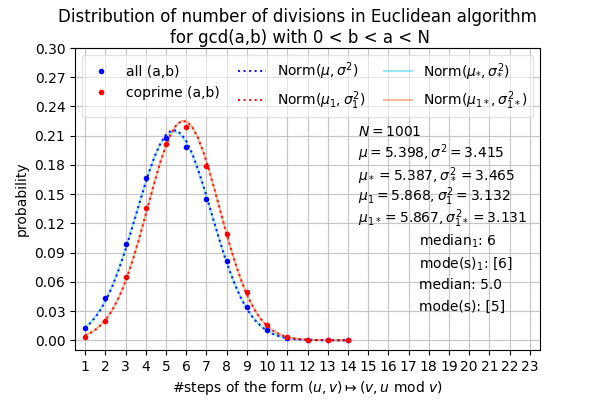
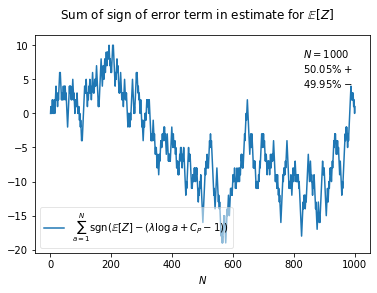
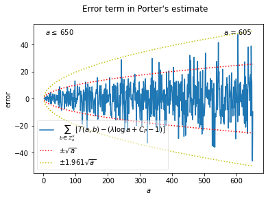
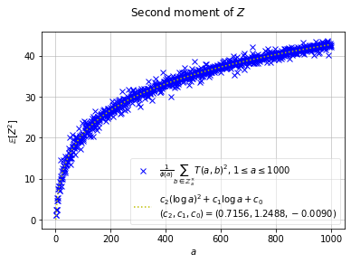
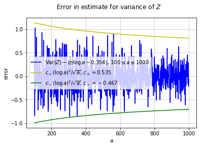
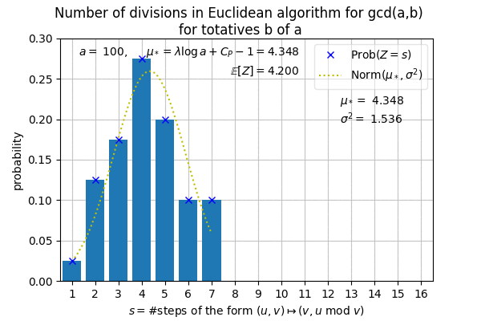
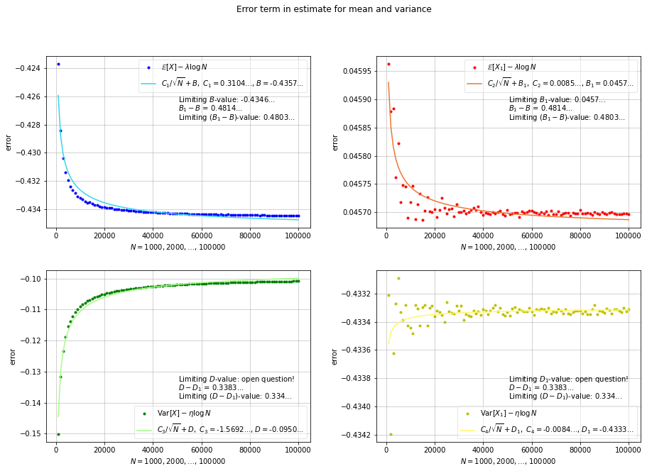

## Analysis of Euclid's Algorithm

<a id='introduction'></a>
### § 1. Introduction

<sup>Jump to: ↓ [Some plots](#pictures) | ↓ [Table of Contents](#toc) </sup>

Euclid's algorithm "might be called the grandaddy of all algorithms", as Knuth aptly put it [[5]](#references). Countless modern-day students know the joy of performing the algorithm by hand, essentially in the form set down by Euclid in his _Elements_ over two thousand years ago. Analyses of the algorithm go back as far as the 18th century, when it was understood (at least implicitly) that consecutive Fibonacci numbers give rise to the worst-case in terms of the number of divisions performed, relative to the size of the inputs. Average-case analyses and finer points received surprisingly little attention until the latter half of the last century. (See Knuth [[5]](#references) and Shallit [[9]](#references) for superlatively detailed accounts of the algorithm's fascinating history.) Only in recent decades has Euclid's algorithm been put into a general framework for the analysis of algorithms (by Baladi and Vallée [[1]](#references) et al.), in which certain algorithms are viewed as dynamical systems: the mathematics is as beautiful as it is deep. Although the current state-of-the-art paints a fairly detailed picture with respect to the distributional analysis of Euclid's algorithm, it still tantalises us with open questions, and these questions remain focal points of some exciting research programmes. 



Indeed, one of our goals here is to shed some light (numerically) on a certain "obscure" constant that arises in the analysis of Euclid's algorithm. Our main goal, though, is simply to demonstrate how fun and instructive it can be to study introductory discrete mathematics and statistics alongside basic Python. We'll code Euclid's algorithm, apply it to almost five billion pairs of integers to produce some data, then tabulate and visualise the results (the above animation is just one example). Along the way, we'll discuss the Fibonacci numbers and touch on **dynamic programming**, among other things like **random walks**... [Libraries](#libraries) we'll use include **NumPy**, **SciPy**, **Matplotlib**, and **pandas**. 

There are various ways of analysing Euclid's algorithm. Here is one example. Let $X$ be the random variable whose value is the number divisions performed in the computation of $\gcd(a,b)$ via Euclid's algorithm, with $(a,b)$ chosen uniformly at random from the region $1 \le b < a \le N$. It is known that $X$ is asymptotically normal (as $N \to \infty$), with mean close to $\lambda\log N + \nu - \frac{1}{2}$ and variance close to $\eta\log N + \kappa$, for certain constants $\lambda, \nu, \eta, \kappa$. While the constants associated with the mean can be written in closed form and easily calculated to any desired degree of accuracy ($\lambda = 0.8427659\ldots$ and $\nu = 0.0653514\ldots$), those associated with the variance cannot. Nevertheless, $\eta$ and $\kappa$ are polynomial-time computable, and the first seven digits of $\eta$ have been determined: $\eta = 0.5160524\ldots$. The "subdominant" constant $\kappa$ is even more mysterious, and our numerics will lead us to guess an approximate value for it (we believe it is around $-0.1$). 

In the above animation, the distribution of $X$ is shown for various $N$ up to $10^5$ (starting with $N = 1000$ and going up by $1000$ in each frame). The large blue dots give the probability that $X$ equals a given number on the horizontal axis. The dotted blue curve is normal with mean $\mu = \mathbb{E}[X]$ and variance $\sigma^2 = \mathrm{Var}(X)$, while the light blue curve is normal with mean $\mu_* = \lambda\log N + \nu - \frac{1}{2}$ and variance $\sigma_*^2 = \eta \log N - 0.1$. The red dots and curves are analagous, but only coprime pairs $(a,b)$ are considered. See [Two-dimensional analysis: distribution](#2d-distribution) for more detail and context.

<a id='pictures'></a>
#### Some plots

<sup>Jump to: ↑ [§ 1. Introduction](#introduction) | ↓ [Table of Contents](#toc)</sup>

Is this a _random walk?_ See [One-dimensional analysis: mean and error term](#1d-investigation-mean) for the answer.



See [One-dimensional analysis: mean and error term](#1d-investigation-mean) for the context of this instance of _square-root-cancellation_.



See [One-dimensional analysis: variance](#1d-investigation-variance) for more about the next two plots.





See [One-dimensional analysis: distribution](#1d-investigation) for an explanation of the animation below.



See [Two-dimensional analysis: error terms & subdominant constant in the variance](#2d-investigation) for an explanation of the plots below.



<a id='toc'></a>
#### Table of Contents

<sup>Jump to: ↑ [Some plots](#pictures) | ↓ [Libraries](#libraries) </sup>

 § 1... [Introduction](#introduction) [Maths/Visuals] <br>
 ............... [Some plots](#pictures) [Visuals] <br>
 § 2... [Libraries](#libraries) [Code] <br>
 § 3... [A quick recap of the GCD and Euclid's algorithm](#definitions) [Maths]<br>
    ............... [Code for Euclid's algorithm](#codeEuclid) [Code] <br>
 § 4... [Worst-case analysis](#worst-case) [Maths/Code] <br>
    ............... [The Fibonacci numbers and dynamic programming](#fibonacci) [Code] <br>
 § 5... [Constants](#constants) [Maths/Code] <br>
 § 6... [One-dimensional analysis](#1d-analysis) [Maths] <br>
    ............... [Average-case analysis](#1d-average-case) [Maths] <br>
    ............... [Error term, variance, and distribution](#1d-higher-moments) [Maths] <br>
 § 7... [Two-dimensional analysis](#2d-analysis) [Maths] <br> 
    ............... [Average-case analysis](#average-case) [Maths] <br>
    ............... [Variance and distribution](#distribution) [Maths] <br>
 § 8... [Code for analysing Euclid's algorithm](#code-for-analysing) [Code] <br>
 § 9... [Generating and exporting/importing the raw data](#raw-data) [Code] <br>
 § 10... [Numerical investigation & data visualisation](#numerical-investigation) <br>
     ............... [One-dimensional analysis: distribution](#1d-investigation) [Maths/Code/Visuals] <br>
     ............... [One-dimensional analysis: mean and error term](#1d-investigation-mean) [Maths/Code/Visuals] <br>
     ............... [One-dimensional analysis: variance](#1d-investigation-variance) [Maths/Code/Visuals] <br>
     ............... [Two-dimensional analysis: error terms & subdominant constant in the variance](#2d-investigation) [Maths/Code/Visuals] <br>
     ............... [Two-dimensional analysis: distribution](#2d-distribution) [Maths/Code/Visuals] <br>
[References](#references) 

<a id='libraries'></a>
### § 2. Libraries

<sup>Jump to: [Table of Contents](#toc) | ↓ [A quick recap of the GCD and Euclid's algorithm](#definitions)</sup>

```python
# We'll use the following libraries (by the end of this Notebook).

import numpy as np # Naturally, we'll need to do some numerics.
import pandas as pd # We'll want to put data in data frames to import and export it, and to display it nicely.
from timeit import default_timer as timer # We'll want to see how long certain computations take.
import scipy.stats as stats # We'll want to plot normal curves and so on.
from scipy.optimize import curve_fit # We'll want to do some curve-fitting.
from scipy.special import zeta # For certain constants involving the Riemann zeta function.
import matplotlib.pyplot as plt # We'll want to plot our data.
from matplotlib import animation # We'll even make animations to display our data.
from matplotlib import rc # For animations.
from IPython.display import HTML # For displaying and saving animations.
from matplotlib.animation import PillowWriter # To save animated gifs.
```

<a id='definitions'></a>
### § 3. A quick recap of the GCD and Euclid's algorithm

<sup>Jump to: [Table of Contents](#toc) | ↑ [Libraries](#libraries) | ↓ [Code for Euclid's algorithm](#codeEuclid)</sup>

---
**Proposition 3.1.** Let $a,b \in \mathbb{Z}$. There exists a unique nonnegative $g \in \mathbb{Z}$ such that, for any $d \in \mathbb{Z}$, $d \mid a$ and $d \mid b$ if and only if $d \mid g$. 

---
**Definition 3.2.** The integer $g$ is the _greatest common divisor_ of $a$ and $b$, denoted $\gcd(a,b)$. The common divisors of $a$ and $b$ are precisely the divisors of $\gcd(a,b)$.

---
The divisors of $g$ are the divisors of $-g$, so $-\gcd(a,b)$ satisfies the definition of greatest common divisor sans nonnegativity. Were we to generalize the notion of gcd to commutative rings, we would say that $g$ is _a_ gcd of $a$ and $b$ if the common divisors of $a$ and $b$ are precisely the divisors of $g$. Then, coming back to the integers, we would say that $g$ and $-g$ are both gcds of $a$ and $b$, but that gcds (in $\mathbb{Z}$) are unique _up to multiplcation by a unit_ ($\pm 1$).

Note that, for all $a \in \mathbb{Z}$, $\gcd(a,0) = |a|$ as all integers divide $0$ (hence the common divisors of $a$ and $0$ are the divisors of $a$). In particular, $\gcd(0,0) = 0$.

How can we compute $\gcd(a,b)$ when $a$ and $b$ are nonzero?

**Euclid's algorithm.** If $b \ge 1$, the division algorithm gives unique integers $q$ and $r$ such that $a = qb + r$ and $0 \le r < b$. It is straightforward to verify that the common divisors of $a$ and $b$ are precisely the common divisors of $b$ and $r$. Hence $\gcd(a,b) = \gcd(b,r)$. If $r > 0$ we may apply the division algorithm again: $b = q_2r + r_3$ with $0 \le r_3 < r$ and $\gcd(b,r) = \gcd(r,r_3)$. Repeating the process as many times as necessary, we obtain a sequence 

<a id='eq:rem_seq'></a>
$$a = r_0, b = r_1 > r = r_2 > r_3 > \cdots > r_n > r_{n + 1} = 0 \tag{3.1}$$ 

with the property that $\gcd(r_{i-1},r_{i}) = \gcd(r_{i},r_{i + 1})$ for $i = 1,\ldots,n$, because

<a id='eq:rem_seq2'></a>
$$r_{i - 1} = q_ir_i + r_{i + 1} \quad (i = 1,\ldots,n). \tag{3.2}$$

But $\gcd(r_n,r_{n + 1}) = \gcd(r_n,0) = r_n$, and so in this way we find the gcd of $a$ and $b$ (and of $\gcd(r_{i},r_{i + 1})$ for $i = 1,\ldots,n$). The case $b \le -1$ is similar, but instead of $(3.1)$ we have

<a id='eq:rem_seq_neg'></a>
$$a = r_0, b = r_1 < r_2 < r_3 < \cdots < r_{n} < r_{n + 1} = 0 \tag{3.3}$$

and $\gcd(a,b) = -r_n$. However, since $\gcd(a,b) = \gcd(|a|,|b|)$, we will typically assume that $a$ and $b$ are nonnegative.

---
**Definition 3.3.** Given $a,b \in \mathbb{Z}$, let $T(a,b) = n$ with $n$ as in [$(3.1)$](#eq:rem_seq) (if $b \ge 0$) or [$(3.3)$](#eq:rem_seq_neg) (if $b \le 0$). Thus, $T(a,b)$ is the number of "steps" or "divisions" in Euclid's algorithm for computing $\gcd(a,b)$. 

---

<a id='codeEuclid'></a>
#### Code for Euclid's algorithm

<sup>Jump to: [Table of Contents](#toc) | ↑ [A quick recap of the GCD and Euclid's algorithm](#definitions) | ↓ [Worst-case analysis](#worst-case)</sup>

```python
# Let's code Euclid's algorithm in a few different ways.
# No special libraries are required for this code block.
# If we just want gcd(a,b), this is about the most straightforward way. 

def gcd(a,b):
    if b == 0:
        return abs(a)
    return gcd(b,a%b)

# As a side-note, the definition of gcd extends in an obvious way to gcd of an n-tuple of integer, n >= 2.
# Namely, gcd(a_1,...,a_n) is the unique nonnegative integer with the following property.
# For any integer d, d divides every a_i if and only if d divides gcd(a_1,...,a_n).
# Thus, gcd(a_1,...,a_n) = gcd(a_1,gcd(a_2,...,a_n)), and we can use recursion to compute the gcd of an n-tuple, as below.

def gcdn(*ntuple): # arbitrary number of arguments
    if len(ntuple) == 2:
        return gcd(ntuple[0], ntuple[1])
    return gcd(ntuple[0],gcdn(*ntuple[1:]))

# If we want gcd(a,b) and the number of steps (T(a,b)), we can use this.

def gcd_steps(a,b,i): # Input i = 0
    if b == 0:
        return abs(a), i # Output gcd(a,b) and i = T(a,b)
    i += 1
    return gcd_steps(b,a%b,i)

# If we want the sequence of remainders 
# [r_0,r_1,r_2,...,r_n] (a = r_0, b = r_1, r_{n + 1} = 0, r_1 > r_2 > ... > r_n > 0),
# we can use this.

def rem(a,b,r): # Input r = []
    r.append(a)
    if b == 0:
        return r
    return rem(b,a%b,r) # gcd(a,b) = abs(r[-1]), gcd_steps = len(r) - 1

# If we want to record both remainders and quotients [q_1,...,q_n], we can use this.

def quot_rem(a,b,q,r): # Input r = [] and q = []
    r.append(a)
    if b == 0:
        return q, r
    (Q, R) = divmod(a,b)
    q.append(Q)
    return quot_rem(b,R,q,r) # rem(a,b,r) = quot_rem(a,b,q,r)[1]

# If we want to write out the entire process, we can use this.

def write_euclid(a,b): 
    q, r = quot_rem(a,b,[],[])  
    R = r[2:] # The next few lines are largely to facilitate the formatting of the output (alignment etc.)
    R.append(0)
    A, B, Q = r, r[1:], q 
    GCDcol = [f'gcd({a},{b})', f'gcd({b},{R[0]})']
    for i in range(len(R) - 1):
        GCDcol.append(f'gcd({R[i]},{R[i + 1]})')
    for i in range(len(B)): # For display, put parentheses around negative integers.
        if B[i] < 0:
            B[i] = f'({B[i]})'
    for i in range(len(Q)): # For display, put parentheses around negative integers.
        if Q[i] < 0:
            Q[i] = f'({Q[i]})' 
    pm = [] # Next few lines are so we display a = bq - r instead of a = bq + -r in the case where r < 0.
    for i in range(len(R)): 
        if R[i] < 0:
            R[i] = -R[i]
            pm.append('-')
        else:
            pm.append('+')
    colA = max([len(str(i)) for i in A]) # For alignment.
    colB = max([len(str(i)) for i in B])
    colQ = max([len(str(i)) for i in Q])
    colR = max([len(str(i)) for i in R])
    colGCDl = max([len(i) for i in GCDcol[:-2]])
    colGCDr = max([len(i) for i in GCDcol[1:]])
    if len(A) > 1:
        for i in range(len(R)):
            print(f'{A[i]:>{colA}} = {Q[i]:>{colQ}}*{B[i]:>{colB}} {pm[i]} {R[i]:>{colR}} \t ∴ {GCDcol[i]:>{colGCDl}} = {GCDcol[i + 1]:<{colGCDr}}')
    print(f'\ngcd({a},{b}) = {abs(r[-1])}, T({a},{b}) = {len(r) - 1}\n') 
```
```python
# Try out some of the above code.

write_euclid(1011,69)
```
```
1011 = 14*69 + 45 	 ∴ gcd(1011,69) = gcd(69,45)
  69 =  1*45 + 24 	 ∴   gcd(69,45) = gcd(45,24)
  45 =  1*24 + 21 	 ∴   gcd(45,24) = gcd(24,21)
  24 =  1*21 +  3 	 ∴   gcd(24,21) = gcd(21,3) 
  21 =  7* 3 +  0 	 ∴    gcd(21,3) = gcd(3,0)  

gcd(1011,69) = 3, T(1011,69) = 5
```

```python
write_euclid(-1011,-69)
```

```
-1011 = 14*(-69) - 45 	 ∴ gcd(-1011,-69) = gcd(-69,-45)
  -69 =  1*(-45) - 24 	 ∴   gcd(-69,-45) = gcd(-45,-24)
  -45 =  1*(-24) - 21 	 ∴   gcd(-45,-24) = gcd(-24,-21)
  -24 =  1*(-21) -  3 	 ∴   gcd(-24,-21) = gcd(-21,-3) 
  -21 =  7* (-3) +  0 	 ∴    gcd(-21,-3) = gcd(-3,0)   

gcd(-1011,-69) = 3, T(-1011,-69) = 5
```

<a id='worst-case'></a>
### § 4. Worst-case analysis

<sup>Jump to: [Table of Contents](#toc) | ↑ [Code for Euclid's algorithm](#codeEuclid) | ↓ [The Fibonacci numbers and dynamic programming](#fibonacci)</sup>

First let's record a result that will be useful in the sequel.

---
<a id='prop:4.1'></a>
**Proposition 4.1.** We have the following for $a \ge b \ge 1$. <br>
(a) $T(a,b) = 1$ if and only if $b \mid a$. <br>
(b) If $a > b$, $T(b,a) = T(a,b) + 1$. <br>
(c) For all positive integers $d$, $T(da,db) = T(a,b)$.

---
>_Proof._ (a) Simply note that $b \mid a$ if and only if there exists an integer $q$ such that $a = qb + 0$.
>
>(b) If $1 \le b < a$ then the first two divisions of the Euclidean algorithm for $\gcd(b,a)$ are: $b = 0a + b$ and $a = qb + r$, $0 \le r < b$. The second division is the first done in the Euclidean algorithm for $\gcd(a,b)$.
>
>(c) If [$(3.1)$](#eq:rem_seq) is the remainder sequence given by Euclid's algorithm for $\gcd(a,b)$, then for any positive integer $d$, 
>
>$$da = dr_0, db = dr_1 > dr_2 > \cdots > dr_n > dr_{n + 1} = 0$$
>
>is the remainder sequence given by Euclid's algorithm for $\gcd(da,db)$ (the quotients $q_i$ in [$(3.2)$](#eq:rem_seq2) won't change).

```python
# Let's illustrate the invariance of the number of divisions under (a,b) -> (da,db). 
# Take (a,b) as in the previous code block and d = 67.

write_euclid(67*1011,67*69)
```

```
# Let's illustrate the invariance of the number of divisions under (a,b) -> (da,db). 
# Take (a,b) as in the previous code block and d = 67.

write_euclid(67*1011,67*69)
```

What are the smallest possible values of $a$ and $b$ if $a \ge b \ge 1$ and $T(a,b) = n$? If $n = 1$ we need only note that $T(1,1) = 1$ to see that the answer is $a = b = 1$. Since $T(a,b) = 1$ if and only if $b \mid a$, the answer for $n \ge 2$ must satisfy $a > b \ge 2$ and $b \nmid a$. (In fact, by [Proposition 4.1(c)](#prop:4.1), the answer in general must satisfy $\gcd(a,b) = 1$, i.e. $r_n = 1$.) Noting that $T(3,2) = 2$ then gives the answer for $n = 2$ as $a = 3$ and $b = 2$. 

```python
# Some very naive code to answer the question: what are the smallest possible values of a and b if 
# a >= b >= 1 and T(a,b) = n?
# Basically a very inefficient way of computing Fibonacci numbers, the code really starts to get slow for n = 16.
# But the first few n are enough to help us see a pattern.

def W(n):
    a, b = 1, 1
    while gcd_steps(a,b,0)[1] < n:
        a += 1
        for b in range(1,a+1):
            if gcd_steps(a,b,0)[1] == n:
                return a, b
    return a, b

print(W(1), W(2), W(3), W(4), W(5), W(6), W(7), W(8), W(9), W(10))
```

```
(1, 1) (3, 2) (5, 3) (8, 5) (13, 8) (21, 13) (34, 21) (55, 34) (89, 55) (144, 89)
```

It isn't difficult to see that for a given $n \ge 2$, if $T(a,b) = n$, $a$ and $b$ will be minimal if, in [$(3.2)$](#eq:rem_seq2), $r_n = 1$, $r_{n - 1} = 2$, and $q_1 = q_2 = \cdots = q_{n - 1} = 1$. Thus, $r_{n - 2} = 1(2) + 1 = 3$, $r_{n - 3} = 1(3) + 2 = 5$, and so on.

```python
write_euclid(55,34)
```

```
55 = 1*34 + 21 	 ∴ gcd(55,34) = gcd(34,21)
34 = 1*21 + 13 	 ∴ gcd(34,21) = gcd(21,13)
21 = 1*13 +  8 	 ∴ gcd(21,13) = gcd(13,8) 
13 = 1* 8 +  5 	 ∴  gcd(13,8) = gcd(8,5)  
 8 = 1* 5 +  3 	 ∴   gcd(8,5) = gcd(5,3)  
 5 = 1* 3 +  2 	 ∴   gcd(5,3) = gcd(3,2)  
 3 = 1* 2 +  1 	 ∴   gcd(3,2) = gcd(2,1)  
 2 = 2* 1 +  0 	 ∴   gcd(2,1) = gcd(1,0)  

gcd(55,34) = 1, T(55,34) = 8
```

These are the Fibonacci numbers!

---
**Definition 4.2.** Let $\mathrm{f}_0 = 0$, $\mathrm{f}_1 = 1$, and $\mathrm{f}_{n+2} = \mathrm{f}_{n + 1} + \mathrm{f}_{n}$ for $n \ge 0$. Then $(\mathrm{f}_0,\mathrm{f}_1,\ldots)$ is the _Fibonacci sequence_, and $\mathrm{f}_n$ is the $n$-th _Fibonacci number_.

---
<a id='prop:4.3'></a>
**Proposition 4.3.** Let $a \ge b \ge 1$. (a) For $n \ge 0$, we have $\gcd(\mathrm{f}_{n + 1},\mathrm{f}_{n}) = 1$. For $n \ge 1$, we have $T(\mathrm{f}_{n + 2},\mathrm{f}_{n + 1}) = n$. (b) If $n \ge 1$ and $T(a,b) = n$, then $a \ge \mathrm{f}_{n + 2}$ and $b \ge \mathrm{f}_{n+1}$. 

---
>_Proof._ (a) Since $\mathrm{f}_{n + 2} = \mathrm{f}_{n + 1} + \mathrm{f}_{n}$, we have $\gcd(\mathrm{f}_{n + 2},\mathrm{f}_{n + 1}) = \gcd(\mathrm{f}_{n + 1},\mathrm{f}_{n})$. Since $\gcd(\mathrm{f}_1,\mathrm{f}_0) = \gcd(1,0) = 1$, that $\gcd(\mathrm{f}_{n + 1},\mathrm{f}_n) = 1$ for all $n \ge 0$ now follows by mathematical induction. 
>
>Also, since $\mathrm{f}_{n + 2} = \mathrm{f}_{n + 1} + \mathrm{f}_n$ _and_ $0 \le \mathrm{f}_n < \mathrm{f}_{n + 1}$ for $n \ge 2$, we have $T(\mathrm{f}_{n + 2},\mathrm{f}_{n + 1}) = T(\mathrm{f}_{n + 1}, \mathrm{f}_n) + 1$ for $n \ge 2$. Since $T(\mathrm{f}_{1 + 2},\mathrm{f}_{1 + 1}) = T(2,1) = 1$, that $T(\mathrm{f}_{n + 2},\mathrm{f}_{n + 1}) = n$ for all $n \ge 1$ now follows by mathematical induction. 
>
>(b) We've verified the result for $n = 1$ and $n = 2$, so let $n \ge 2$ and suppose the result holds for $n$. Let $T(a,b) = n + 1$. Since this is greater than $1$, $b \nmid a$ (as noted above), and $a = qb + r$ for some $q$ and $r$ with $q \ge 1$ and $1 \le r < b$. Now, $T(b,r) = n$ and so, by inductive hypothesis, $b \ge \mathrm{f}_{n + 2}$ and $r \ge \mathrm{f}_{n + 1}$. Thus, $a = qb + r \ge \mathrm{f}_{n + 2} + \mathrm{f}_{n+1} = \mathrm{f}_{n + 3}$. In conclusion, $a \ge \mathrm{f}_{n + 3}$ and $b \ge \mathrm{f}_{n + 2}$, and the result holds for all $n \ge 2$, by mathematical induction.

---
**Remark 4.4.** For $a \ge b \ge 1$ and $n \ge 1$, the contrapositive of part (b) of the above proposition is: if either $a < \mathrm{f}_{n + 2}$ or $b < \mathrm{f}_{n + 1}$, then $T(a,b) \le n - 1$.

---

```python
# Let's test this out for small n. 
# In the table below, row a column b contains T(a,b).
# Below the diagonal corresponds to a > b.
# Note that, for instance, the first time 4 appears below the diagonal is in row 8, column 5: 8 = f_6 and 5 = f_5.

test_dict = {}
for a in range(14):
    test_dict[a] = {}
    for b in range(14):
        test_dict[a][b] = gcd_steps(a,b,0)[1]
        
# To "tabulate" our data, we'll use pandas. 
# import pandas as pd # Only needed if not already pre-loaded.

pd.DataFrame.from_dict(test_dict, orient='index')#.astype('int')
```

```
	0	1	2	3	4	5	6	7	8	9	10	11	12	13
0	0	1	1	1	1	1	1	1	1	1	1	1	1	1
1	0	1	2	2	2	2	2	2	2	2	2	2	2	2
2	0	1	1	3	2	3	2	3	2	3	2	3	2	3
3	0	1	2	1	3	4	2	3	4	2	3	4	2	3
4	0	1	1	2	1	3	3	4	2	3	3	4	2	3
5	0	1	2	3	2	1	3	4	5	4	2	3	4	5
6	0	1	1	1	2	2	1	3	3	3	4	4	2	3
7	0	1	2	2	3	3	2	1	3	4	4	5	5	4
8	0	1	1	3	1	4	2	2	1	3	3	5	3	6
9	0	1	2	1	2	3	2	3	2	1	3	4	3	4
10	0	1	1	2	2	1	3	3	2	2	1	3	3	4
11	0	1	2	3	3	2	3	4	4	3	2	1	3	4
12	0	1	1	1	1	3	1	4	2	2	2	2	1	3
13	0	1	2	2	2	4	2	3	5	3	3	3	2	1
```
